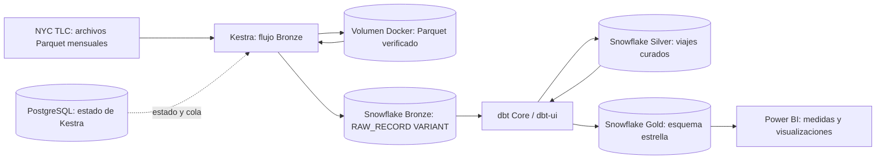
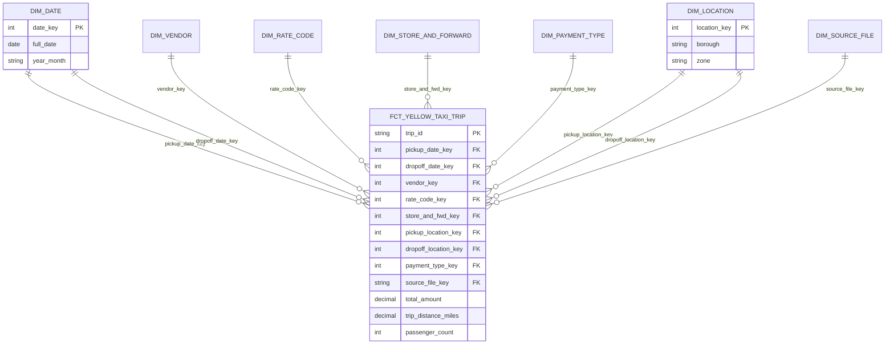

# Semana 07 — infraestructura NYC Yellow Taxi

Esta carpeta contiene la infraestructura local y la estructura de código para
el laboratorio descrito en [TASK.md](TASK.md). Kestra orquesta, PostgreSQL
almacena únicamente el estado de Kestra y dbt Core se ejecuta dentro del
backend de dbt-ui. Snowflake es externo a Docker Compose.

Este entregable incluye la infraestructura, la ingesta Bronze y los modelos dbt
Bronze → Silver → Gold. Los modelos dbt se encuentran en
`src/main/dbt/nyc_yellow_taxi/models`.

La fuente prevista es la [página oficial de datos TLC](https://www.nyc.gov/site/tlc/about/tlc-trip-record-data.page),
que publica archivos mensuales Parquet. Compruebe la disponibilidad de cada
mes antes de iniciar la ingesta: al preparar esta infraestructura, agosto de
2026 aún no figuraba entre los archivos Yellow Taxi publicados.

## Diagrama de arquitectura



El flujo de datos avanza de izquierda a derecha. PostgreSQL no contiene datos
de viajes: solo conserva el estado operativo de Kestra. El volumen Docker evita
la corrupción de descargas Parquet antes de que Kestra las cargue a Bronze.

## Diagrama del esquema estrella



El grano de `FCT_YELLOW_TAXI_TRIP` es una fila por viaje Yellow Taxi válido y
deduplicado. `DIM_DATE` y `DIM_LOCATION` son dimensiones de rol: la misma tabla
se relaciona dos veces, para recogida y destino.

## Documentación técnica detallada

La documentación breve de este README sirve como mapa. Para entender o auditar
cada decisión de implementación, consulte los documentos anidados:

- [Guía de infraestructura y flujo Kestra](src/main/kestra/flows/README.md):
  ingesta Bronze, secretos y manejo de descargas Parquet.
- [Guía de implementación Silver](docs/DBT_SILVER_IMPLEMENTATION_GUIDE.md):
  tipado, validación, nulos, imputación de pasajeros y normalización semántica.
- [Guía de implementación Gold](docs/GOLD_FACT_IMPLEMENTATION_GUIDE.md):
  grano de la tabla de hechos, dimensiones, métricas, claves y comandos dbt.
- [Modelos Silver](src/main/dbt/nyc_yellow_taxi/models/silver) y
  [modelos Gold](src/main/dbt/nyc_yellow_taxi/models/gold): comentarios inline
  y explicaciones READ-AFTER-CODE junto al SQL ejecutable.
- [Contrato y pruebas dbt Gold](src/main/dbt/nyc_yellow_taxi/models/gold/schema.yml):
  claves primarias, relaciones y pruebas de integridad.

## Estructura y montajes

| Ruta local | Destino / función |
| --- | --- |
| `src/main/kestra/flows` | `/workspace/kestra/flows` en Kestra; código de flujos versionado. |
| `src/main/dbt/nyc_yellow_taxi` | Proyecto descubierto por dbt-ui bajo `/workspace/dbt-projects`. |
| `src/res/config/kestra/application.yml` | `/etc/kestra/application.yml` en Kestra, solo lectura. |
| `src/res/config/dbt/profiles/profiles.yml` | `/home/dbtui/.dbt/profiles.yml` en dbt-ui y dbt CLI, solo lectura. |
| `src/res/config/snowflake/bootstrap` | Scripts SQL para una base Snowflake ya existente; no se ejecutan al iniciar Compose. |
| `src/res/docker/custom-images` | Dockerfiles fijados a la misma revisión de dbt-ui usada en semana 05 y configuración Nginx. |
| `src/res/env/.env.example` | Plantilla para `src/res/env/.env`, que no se versiona. |
| `kestra_raw_data` (volumen Docker) | `/workspace/data/raw` en Kestra; volumen Linux persistente para los Parquet descargados y verificados antes de cargarlos al stage Bronze. |
| `src/res/logs/kestra`, `src/res/logs/dbt` | Directorios locales de trabajo y registros, excluidos de Git. |
| `docs` | Guías detalladas de las capas Silver y Gold. |

Los volúmenes Docker `kestra_postgres_data`, `kestra_internal_storage`,
`kestra_raw_data` y `dbt_ui_data` conservan respectivamente la base de Kestra,
sus archivos internos, los Parquet de trabajo y el estado de dbt-ui. Un YAML montado en Kestra no se importa solo:
se importa mediante la UI o API y se vuelve a importar tras cambiarlo.

## Requisitos

- Docker con Compose v2 y capacidad para construir las dos imágenes de dbt-ui.
- Acceso a la revisión fijada del repositorio `EricLamphere/dbt-ui` durante la
  construcción de imágenes.
- Una cuenta, warehouse y base de datos Snowflake existentes para las pruebas
  de conexión y el desarrollo posterior de la tubería.

## Inicio local

Desde `laboratorios/semana-07`:

```bash
cp src/res/env/.env.example src/res/env/.env
# Cambie KESTRA_POSTGRES_PASSWORD y, cuando corresponda, las variables SNOWFLAKE_*.
docker compose --env-file src/res/env/.env config --quiet
docker compose --env-file src/res/env/.env up -d --build
docker compose --env-file src/res/env/.env ps
```

Kestra abre en <http://127.0.0.1:40770> y dbt-ui en
<http://127.0.0.1:40772>. El endpoint de administración de Kestra está en
<http://127.0.0.1:40771/health>. Estos puertos pueden cambiarse en `.env`.
PostgreSQL no se publica al host.

Las variables Snowflake pueden quedar vacías durante el arranque local. Para
ejecutar Bronze, complete `SNOWFLAKE_ACCOUNT`, `SNOWFLAKE_USER`,
`SNOWFLAKE_PASSWORD` y `SNOWFLAKE_WAREHOUSE` en `.env`; `SNOWFLAKE_ROLE` es
opcional si el rol predeterminado tiene permisos suficientes. dbt recibe esas
variables directamente. Kestra recibe las variables `SECRET_SNOWFLAKE_*`
codificadas en Base64, consumidas por el flujo mediante `secret('SNOWFLAKE_*')`;
consulte [la guía del flujo](src/main/kestra/flows/README.md) para generarlas.
La base y el esquema Bronze existentes son `S_CDATOS_LABORATORIOINT` y
`S_CDATOS_BRONZE`. Nunca copie credenciales literales al repositorio.

## Preparación de Snowflake

Si todavía no existen la base y los esquemas, en un worksheet con permisos:

1. Cambie `<existing_project_database>` en
   `src/res/config/snowflake/bootstrap/001_schemas.sql` por el identificador de
   esa base y ejecute el script completo.
2. En la misma sesión, ejecute
   `src/res/config/snowflake/bootstrap/002_parquet_stage.sql`.
3. Ponga ese mismo nombre en `SNOWFLAKE_DATABASE` de `.env`.

Los scripts crean `S_CDATOS_BRONZE`, `S_CDATOS_SILVER` y `S_CDATOS_GOLD`, junto con un formato y
stage Parquet en Bronze. El flujo Bronze también puede crear el formato, stage
y tabla por sí solo si la base y el esquema ya existen. Para importar, ejecutar
y verificar el flujo, consulte [su guía](src/main/kestra/flows/README.md).

## Comprobaciones

```bash
curl --fail http://127.0.0.1:40771/health
curl --fail http://127.0.0.1:40772/
docker compose --env-file src/res/env/.env exec kestra ls -la /workspace/data/raw
docker compose --env-file src/res/env/.env exec dbt-ui-backend /opt/dbt-ui/backend/.venv/bin/dbt --version
docker compose --env-file src/res/env/.env --profile dbt-cli run --rm dbt-core --version
```

Con Snowflake configurado y los scripts ejecutados:

```bash
docker compose --env-file src/res/env/.env --profile dbt-cli run --rm dbt-core debug

# Después de que Kestra haya cargado Bronze, construir y probar Bronze → Silver.
docker compose --env-file src/res/env/.env --profile dbt-cli run --rm dbt-core \
  build --select path:models/silver

# Cargar el catálogo oficial de zonas TLC y construir Gold.
docker compose --env-file src/res/env/.env --profile dbt-cli run --rm dbt-core \
  seed --select taxi_zone_lookup
docker compose --env-file src/res/env/.env --profile dbt-cli run --rm dbt-core \
  build --select path:models/gold
```

`dbt build --select path:models/silver` crea los modelos Silver y ejecuta sus
pruebas `not_null`, `unique` y `relationships`. El modelo incremental de viajes
es idempotente y actualiza las filas cuyo `LOADED_AT` Bronze haya cambiado.

Después de construir Silver, revise la evidencia de nulos antes de interpretar
atributos imputados:

```sql
SELECT *
FROM S_CDATOS_LABORATORIOINT.S_CDATOS_SILVER.SILVER_YELLOW_TAXI_NULL_PROFILE
ORDER BY SOURCE_MONTH, COLUMN_NAME;

SELECT *
FROM S_CDATOS_LABORATORIOINT.S_CDATOS_SILVER.SILVER_YELLOW_TAXI_NULL_CORRELATIONS
ORDER BY SOURCE_MONTH, NULL_JACCARD_SIMILARITY DESC;
```

Una probabilidad condicional de `1.0` en ambas direcciones y una similitud de
Jaccard de `1.0` indican que el par de columnas fue nulo exactamente en las
mismas filas. Las columnas `PASSENGER_COUNT_WAS_IMPUTED` y
`PASSENGER_COUNT_IMPUTATION_METHOD` conservan la trazabilidad de cada imputación.

## Detener y continuar

```bash
docker compose --env-file src/res/env/.env down
```

El comando conserva los volúmenes. `down -v` borra el estado de Kestra, dbt-ui
y los Parquet de trabajo, incluidos flujos importados e historial.
