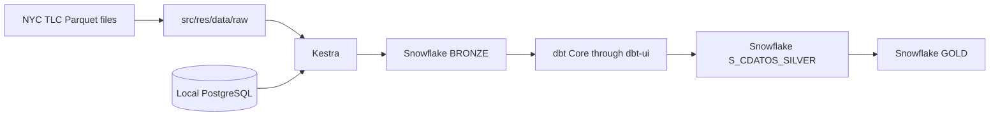

# Infrastructure architecture

The arrows from Kestra to Snowflake and through dbt show the intended pipeline.
The ingestion flow and dbt models are later work; this scaffold starts the local
services and prepares their code and configuration locations.
