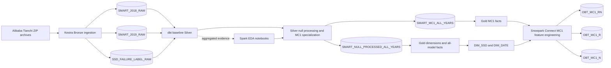

# Pset 2 — SSD failure prediction infrastructure

This project implements the complete SSD telemetry path from source-preserving
Bronze ingestion through dbt Silver and Gold models to the production MC1
one-big-table datasets. Kestra is the ingestion orchestrator, dbt owns the
warehouse transformations, and Snowpark Connect executes the final wide-table
feature engineering inside Snowflake. PostgreSQL is used only by Kestra;
Snowflake remains external to Compose.

For the file-by-file technical design, mounts, persistence model, and Snowflake
bootstrap procedure, see [IMPLEMENTATION.md](IMPLEMENTATION.md).

> **Documentación en español:** [`docs/`](docs/README.md) explica la arquitectura, la ingesta,
> la calidad de datos, el modelado, la OBT, batch vs. streaming, las limitaciones, la ejecución
> paso a paso y un mapa del código, siguiendo la estructura del documento técnico del PSet.

## Documentation map

Start here, then follow the layer links in pipeline order:

| Area | Documentation | What it explains |
| --- | --- | --- |
| Platform | [Infrastructure and persistence](IMPLEMENTATION.md) | Compose services, mounts, volumes, bootstrap, and operational boundaries. |
| Bronze | [Kestra Bronze ingestion](src/main/kestra/flows/README.md) | Manual trigger rationale, source validation, retries, backfill, staging, and idempotent merge behavior. |
| dbt | [dbt transformation project](src/main/dbt/ssd_failure_prediction/README.md) | Project structure, lineage, commands, materializations, and navigation into Silver and Gold. |
| Silver | [Silver processing](src/main/dbt/ssd_failure_prediction/models/silver/README.md) | Baseline extraction, structural-null processing, MC1 specialization, audit quarantine, and final all-year tables. |
| Gold | [Gold dimensional model](src/main/dbt/ssd_failure_prediction/models/gold/README.md) | Dimensions, facts, keys, relationships, and Silver-to-Gold column reconciliation. |
| Spark platform | [Spark platform](src/main/python/spark/README.md) | Dual runtime architecture (Spark 4 / Jupyter vs Snowpark Connect), directory layout, and workflows. |
| EDA | [Spark notebooks](src/main/python/spark/notebooks/README.md) | DataGrip/Jupyter execution, Snowflake pushdown, generated EDA notebooks, and packaged null analysis. |
| EDA evidence | [Null-structure analysis book](src/main/python/spark/notebooks/ssd_null_analysis_book/README.md) | Reproducible notebooks, interpretation chapters, modeling policy, and packaged CSV evidence. |
| OBT | [Snowpark Connect jobs](src/main/python/spark/jobs/README.md) | MC1 rolling features, labels, validation, audit, staging, and canonical publication. |
| Spark tests | [Spark contract unit tests](src/test/python/spark/README.md) | Offline unit testing of OBT schemas (847/429 cols), calendar windows, and projection parity. |
| Spark config | [Spark configuration](src/res/config/spark/README.md) | Engine defaults, memory limits, Log4j 2 suppression, requirements, and custom Jupyter kernel. |
| Runtimes | [Custom Docker images](src/res/docker/custom-images/README.md) | Spark/Jupyter and Snowpark Connect image composition and validation. |

The assignment and implementation specifications remain versioned as supporting
references under [`src/res/prompts`](src/res/prompts/).

## End-to-end lineage



The source acquisition is manual because Alibaba does not expose a stable API,
but every step after the ZIPs reach `src/res/data/raw` is automated and
repeatable.

## Layout and persistence

| Host path / volume | Purpose |
| --- | --- |
| `src/res/data/raw` | Immutable Tianchi archives; bind-mounted read-only at `/usr/data/landing`. It is ignored by Git. |
| `src/main/kestra/flows` | Source-controlled Kestra DAG/flow code. This read-write bind mount is editable from both host and container. |
| `kestra_postgres_data` | Kestra flow definitions after import, queues, executions, metadata, and logs. |
| `kestra_internal_storage` | Kestra task output files and internal local storage. |
| `src/main/dbt` | Source-controlled dbt SQL/YAML project code, visible to dbt-ui at `/workspace/dbt-projects`. |
| `dbt_ui_data` | dbt-ui SQLite state, run history, API logs, and generated UI data. |
| `src/main/python/spark` | Source-controlled PySpark job code. |
| `src/res/config` and `src/res/docker` | Runtime configuration and externally supplied/custom image definitions. |
| `src/res/logs` | Host-visible local runtime logs and working output. |

The flow source directory is intentionally separate from the named Kestra volumes:
you edit and commit it normally, then import a changed YAML into Kestra. A bind
mount does **not** automatically register a flow. PostgreSQL and internal task
storage intentionally remain Docker-managed persistent state.

## Prerequisites

- Docker Desktop with Compose v2 (Apple Silicon is supported by the selected
  multi-platform PostgreSQL and Spark 4.0.4 / Scala 2.13 / Java 21 image).
- At least 4 GB of Docker memory available for Kestra plus local Spark.
- A Snowflake account for Bronze ingestion, dbt Silver/Gold builds, warehouse
  EDA, connector checks, and production Snowpark Connect OBT builds.
- The three archives downloaded manually from Tianchi: `smartlog2018ssd.zip`,
  `smartlog2019ssd.zip`, and `ssd_failure_label.csv.zip`.

## First start

From this directory:

```bash
cp src/res/env/.env.example src/res/env/.env
# Edit src/res/env/.env and replace every placeholder, including JUPYTER_TOKEN.
# A suitable local token can be generated with: openssl rand -hex 32
mkdir -p src/res/data/raw
# Copy the three Tianchi archives into src/res/data/raw yourself.

docker compose --env-file src/res/env/.env config
docker compose --env-file src/res/env/.env build
docker compose --env-file src/res/env/.env up -d
docker compose --env-file src/res/env/.env ps
```

Open Kestra at <http://localhost:8080> and dbt-ui at
<http://localhost:5173>. The configuration binds both to `127.0.0.1`, so they
are not published to the local network. To use different ports, change
`KESTRA_PORT`, `KESTRA_MANAGEMENT_PORT`, or `DBT_UI_PORT` in `src/res/env/.env`.

JupyterLab is available at <http://127.0.0.1:4041> using `JUPYTER_TOKEN` from
the private environment file. The Spark application UI is available at
<http://127.0.0.1:4040> while a Spark session is running. Change
`JUPYTER_PORT` or `SPARK_UI_PORT` if either host port is already occupied.
DataGrip must connect to that remote Jupyter URL and use the
`PySpark 4 + Snowflake` kernel; its local Python interpreter does not contain
the container's Spark runtime or mounted connector helpers.

Import `src/main/kestra/flows/bronze_ingestion.yml` in the Kestra UI
(Flows → Create → Import). It validates and consolidates the selected CSV
members, uploads CSV to the internal Snowflake stage, and idempotently merges
source-faithful `VARIANT` objects into the three Bronze destination tables.

## Validation

```bash
# Kestra UI and management health endpoint
curl --fail http://localhost:${KESTRA_PORT:-8080}/
curl --fail http://localhost:${KESTRA_MANAGEMENT_PORT:-8081}/health

# Confirm the read-only landing mount and required archive names
docker compose exec kestra ls -l /usr/data/landing

# Confirm dbt and its Snowflake adapter are installed in dbt-ui's own venv
docker compose exec dbt-ui-backend /opt/dbt-ui/backend/.venv/bin/dbt --version

# With valid SNOWFLAKE_* values in .env, confirm the dbt profile can connect
docker compose exec --workdir /workspace/dbt-projects/ssd_failure_prediction \
  dbt-ui-backend /opt/dbt-ui/backend/.venv/bin/dbt debug

# Validate Spark runtime, Jupyter, local mode, and the installed connector
docker compose exec spark java -version
docker compose exec spark python3 --version
docker compose exec spark python3 -m jupyterlab --version
docker compose exec spark /opt/spark/bin/spark-submit --version
docker compose exec spark /opt/spark/bin/spark-submit /opt/spark/jobs/build_obt.py

# With valid SNOWFLAKE_* values, execute a small query in the configured warehouse
docker compose exec spark /opt/spark/bin/spark-submit \
  /opt/spark/jobs/check_snowflake_connection.py

# Verify Kestra PostgreSQL persistence after a restart
docker compose restart kestra-postgres kestra
docker compose ps
```

`build_obt.py` does not contact Snowflake; it only starts local Spark and checks
connector discovery. `check_snowflake_connection.py` is the opt-in remote smoke
test and reports the account, role, warehouse, database, and schema selected by
the Snowflake session.

The production MC1 OBT workload uses the separate `snowpark-connect` service
and the dedicated high-compute warehouse rather than this local Spark runtime.
Its bounded validation, development-stage, full publication, and test commands
are documented in
[`src/main/python/spark/jobs/README.md`](src/main/python/spark/jobs/README.md).

## Spark notebooks and Snowflake compute

The Spark image includes JupyterLab, pandas, PyArrow, Matplotlib, Seaborn, the
Snowflake Spark connector, and the Snowflake JDBC driver. Notebooks saved under
`src/main/python/spark/notebooks` are persisted on the host and can import the
shared connector helper:

```python
from snowflake_io import create_spark_session, read_snowflake_table

spark = create_spark_session("smart-quality-analysis")
smart_2018 = read_snowflake_table(
    spark, "SMART_2018", schema="S_CDATOS_PSET2_SILVER"
)
smart_2018.groupBy("model").count().orderBy("count", ascending=False).show()
```

The connector uses the configured `SNOWFLAKE_WAREHOUSE`, and automatic query
pushdown is enabled. Compatible filters, projections, and aggregations can run
inside Snowflake before results cross the network. Spark itself still runs as
`local[*]` in the container, so Spark-only transformations consume local Docker
CPU and memory. Keep large work in Snowflake or in pushdown-compatible DataFrame
operations, and do not call `toPandas()` on an entire SMART table.

## Snowflake bootstrap and dbt

Set the plain `SNOWFLAKE_*` values used by dbt and Spark and the base64-encoded
`SECRET_SNOWFLAKE_*` values used by Kestra in `src/res/env/.env`; never commit
that file. The Bronze flow creates its file format, internal stage, and tables
with `IF NOT EXISTS`. The following scripts remain as an optional manual
bootstrap/reference and can be run in one Snowflake worksheet session:

1. `src/res/config/snowflake/bootstrap/001_database_and_schemas.sql`
2. `src/res/config/snowflake/bootstrap/002_file_formats.sql`
3. `src/res/config/snowflake/bootstrap/003_stages.sql`
4. `src/res/config/snowflake/bootstrap/004_bronze_tables.sql`

The stage file format is CSV. Snowflake constructs one source-faithful
`RAW_RECORD` object from each staged CSV row during the merge. dbt’s project lives at
`src/main/dbt/ssd_failure_prediction`; its profile reads account-specific
values with `env_var()`.

## dbt Silver staging models

dbt materializes three incremental tables in `S_CDATOS_PSET2_SILVER`:

- `SMART_2018`
- `SMART_2019`
- `SSD_FAILURE_LABELS`

Each SMART model extracts the 105 source fields from `RAW_RECORD`—three
identity/date fields and 102 normalized/raw SMART measures—and adds ten derived
key and lineage fields, producing a 115-column baseline relation. The label
model types the disk identifier and parses `failure_time` into `failure_at` and
`failure_date`. No source row is filtered at this baseline stage. The complete
column contracts, structural-null routing, and table materializations are
documented in the [Silver README](src/main/dbt/ssd_failure_prediction/models/silver/README.md).

Every Silver row retains the Bronze archive, member, row number, source date,
content hash, ingestion timestamp, and fully qualified source relation.
`silver_record_id` hashes archive + file + source row and is the stable unique
key used by dbt incremental merges. `source_file_row_hash_key` hashes file +
content hash for content/duplicate analysis, but is deliberately not treated as
unique because two rows in one file may contain identical values.

Run and test this layer with:

```bash
docker compose --env-file src/res/env/.env run --rm --no-deps \
  --workdir /workspace/dbt-projects/ssd_failure_prediction dbt-ui-backend \
  /opt/dbt-ui/backend/.venv/bin/dbt build \
  --profiles-dir /home/dbtui/.dbt --select tag:silver
```

## Stop and reset

```bash
docker compose down       # stops/removes containers and network; keeps volumes
docker compose down -v    # destructive: also deletes Kestra and dbt-ui state
```

Do not use `down -v` unless you intentionally want to erase Kestra history,
imported flows, task output files, and dbt-ui state. The immutable archives are
host files and are not put in a Docker volume.

## Troubleshooting

- A missing archive makes the Bronze ingestion flow fail by design. Verify the
  exact filename and that the file is readable under `src/res/data/raw`.
- On Apple Silicon, ensure Docker Desktop is current and has enough memory;
  the selected Spark 4.0.4 tag publishes an ARM64 variant. If a custom dependency
  later proves AMD64-only, diagnose it explicitly rather than silently forcing
  an emulated platform.
- dbt-ui’s backend is the process that invokes dbt. Do not replace it with an
  unrelated dbt container; that would remove dbt-ui’s subprocess integration.

## Bronze ingestion flow

The flow at `src/main/kestra/flows/bronze_ingestion.yml` reads the three ZIPs
from the read-only landing mount. It validates each source CSV, stages it, and
stores its original names and text values in `RAW_RECORD`. The three Bronze
destinations are `SMART_2018_RAW`, `SMART_2019_RAW`, and
`SSD_FAILURE_LABEL_RAW`. Metadata records the archive, CSV
member, row number, date (when present), and row hash. Replays merge on
archive/member/row number.

The `dataset` input selects `smart_2018`, `smart_2019`, or `failure_labels`
and safely defaults to the small labels dataset. Date inputs are optional,
inclusive `YYYY-MM-DD` filters for SMART files. The planner groups the selected
calendar months in pairs, runs up to six workers in parallel, and makes each
worker extract and upload its source days sequentially. Each daily temporary
file is removed after its Snowflake `PUT`, so even a full-year load does not
materialize a roughly 38 GiB annual CSV. January through March, for example,
uses two workers: January-February and March. A practical first smoke test is
`dataset=failure_labels`; a run with no selected source files fails.

The inspected source contract is 105 columns for both SMART years and three
columns (`model`, `failure_time`, `disk_id`) for the labels. The helper rejects
schema drift, malformed row widths, invalid UTF-8, and hidden ZIP metadata such
as `__MACOSX/._ssd_failure_label.csv`.

### Trigger, error handling, and backfill

Bronze ingestion is started manually because Alibaba/Tianchi does not provide a
stable endpoint that Kestra can poll for these archives. After an archive is
placed in the landing directory, validation, partitioning, upload, merge, and
reconciliation are automated. Deterministic source errors fail immediately;
transient Snowflake DDL, `PUT`, and `MERGE` operations use bounded exponential
retries.

Historical backfills use the inclusive `requested_start_date` and
`requested_end_date` inputs. Reprocessing is idempotent at
`(SOURCE_ARCHIVE, SOURCE_FILE, SOURCE_ROW)`: new rows are inserted, unchanged
rows remain untouched, and changed contents update only when `SOURCE_SHA256`
differs. Bronze deliberately does not delete a previously preserved row merely
because a later archive omits it. The complete trigger rationale, retry limits,
and backfill behavior are documented in the
[Kestra Bronze ingestion README](src/main/kestra/flows/README.md).

Before running, make sure the existing `S_CDATOS_PSET2` database and
`S_CDATOS_PSET2_BRONZE` schema are available to the configured role. Add the
five base64-encoded `SECRET_SNOWFLAKE_*` variables shown in `.env.example`,
restart Kestra so it receives them, and import the flow. The flow itself creates
`SMART_CSV_FORMAT`, `SMART_ARCHIVE_STAGE`, and the three
raw tables if they do not exist. Re-import after edits to the YAML; the helper
script is read from its bind mount on each run. The first live run should still
be checked against Snowflake row counts. The helper uses UTF-8 with an optional
BOM and refuses malformed CSV.
