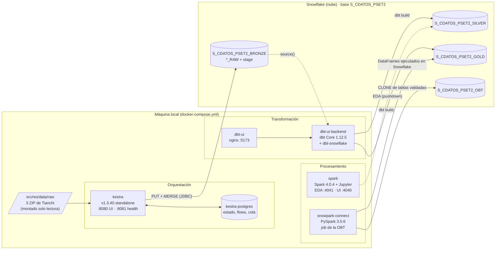
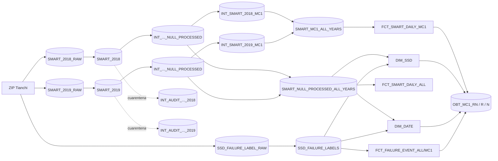

# 1. Arquitectura

[Índice](README.md) · **Arquitectura** · [Siguiente: Ingesta →](02_ingesta_kestra.md)

## Diagrama de infraestructura

Snowflake **no** corre en Docker: es el destino de todas las capas. Localmente solo corren los
motores que mueven y transforman los datos. Todos los puertos se publican en `127.0.0.1`, así
que no quedan expuestos a la red local.

## Servicios

| Servicio | Imagen | Rol en el pipeline | Por qué así |
| --- | --- | --- | --- |
| `kestra` | `kestra/kestra:v1.3.40` | Ingesta Bronze: valida los ZIP, sube los CSV diarios y hace el `MERGE` | Versión fija para que sea reproducible; modo standalone, suficiente para trabajo local |
| `kestra-postgres` | `postgres:17-alpine` | Repositorio y cola de Kestra | Los flows y el historial de ejecuciones sobreviven a un reinicio (con H2 se perderían) |
| `dbt-ui-backend` | propia (`Dockerfile.semana05.backend`) | dbt Core + adaptador Snowflake; construye Silver y Gold | Reutiliza la interfaz de dbt de la semana 05; versiones fijadas como argumentos de build |
| `dbt-ui` | propia (`Dockerfile.semana05.frontend`) | Interfaz web para ejecutar dbt | Conveniencia; el que ejecuta dbt es el backend |
| `spark` | `apache/spark:4.0.4` + conector | Jupyter para el EDA sobre Silver | El conector `spark-snowflake` con *pushdown* evita traer las tablas completas a la máquina |
| `snowpark-connect` | propia (`Dockerfile.pset2.snowpark`) | Construye la OBT con la API de PySpark | El plan se ejecuta **dentro de Snowflake**: ~115 millones de filas MC1 no caben en un contenedor local |

## Flujo de datos

1. **Fuente → Bronze.** Los ZIP se copian a `src/res/data/raw` (Tianchi exige iniciar sesión y
   no ofrece una API). El flow `bronze_ingestion` de Kestra valida cada CSV, le agrega linaje,
   lo sube a un *stage* interno de Snowflake (`PUT`) y lo integra con `MERGE` en
   `SMART_2018_RAW`, `SMART_2019_RAW` o `SSD_FAILURE_LABEL_RAW`.
2. **Bronze → Silver.** dbt lee Bronze con `source()` y crea tablas tipadas e incrementales,
   después aplica la política de nulos (columnas vacías, cuarentena de filas sin mediciones,
   subconjunto MC1). Detalle en [Calidad de datos](03_calidad_de_datos.md).
3. **Silver → Gold.** dbt construye el star schema con `ref()`. Los tests validan el grain, la
   integridad referencial y el conteo de filas entre capas.
4. **Gold → OBT.** `build_mc1_obt.py` (Snowpark Connect) une los hechos MC1 con las dimensiones,
   calcula las etiquetas y las ventanas, valida las tablas *stage* y las publica con `CLONE` en
   `S_CDATOS_PSET2_OBT`.

## Decisiones de arquitectura

- **ELT y no ETL.** Los datos llegan crudos a Snowflake y se transforman allí. Así Bronze
  conserva el original y cualquier regla de limpieza se puede reprocesar sin volver a descargar
  la fuente.
- **Un esquema por capa** (`_BRONZE`, `_SILVER`, `_GOLD`, `_OBT`). Los permisos y el linaje se
  ven a simple vista, y la macro `generate_schema_name` hace que dbt use exactamente esos nombres.
- **Credenciales fuera del repositorio.** Todo se lee de `src/res/env/.env`, que está en
  `.gitignore`. Kestra usa `secret()` (variables `SECRET_*` en base64), dbt usa `env_var()` y
  Spark lee `os.getenv`.
- **Volúmenes de solo lectura** para la fuente (`/usr/data/landing:ro`) y para el código de Spark.
