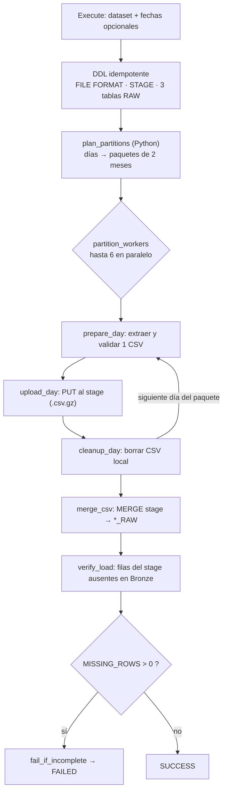

# 2. Ingesta con Kestra

[← Arquitectura](01_arquitectura.md) · [Índice](README.md) · **Ingesta** · [Siguiente: Calidad de datos →](03_calidad_de_datos.md)

Código: [`src/main/kestra/flows/bronze_ingestion.yml`](../src/main/kestra/flows/bronze_ingestion.yml)
y [`prepare_bronze.py`](../src/main/kestra/flows/prepare_bronze.py).

## Fuente y granularidad

| Dataset (input `dataset`) | Archivo en `src/res/data/raw` | Contenido | Tabla Bronze |
| --- | --- | --- | --- |
| `smart_2018` | `smartlog2018ssd.zip` | Un CSV por día (`YYYYMMDD.csv`), 105 columnas | `SMART_2018_RAW` |
| `smart_2019` | `smartlog2019ssd.zip` | Igual, para 2019 | `SMART_2019_RAW` |
| `failure_labels` | `ssd_failure_label.csv.zip` | Un CSV con `model`, `failure_time` y `disk_id` | `SSD_FAILURE_LABEL_RAW` |

- **Granularidad de la fuente:** una fila es la telemetría SMART de un disco en un día. Las
  etiquetas tienen una fila por falla.
- **Granularidad de Bronze:** una fila de Bronze es una fila de un CSV. Su clave natural es
  `(SOURCE_ARCHIVE, SOURCE_FILE, SOURCE_ROW)`.
- **Volumen:** 135,8 millones de filas en 2018 y 137,3 millones en 2019. Un año descomprimido
  ocupa alrededor de 38 GiB.

## Proceso de carga



1. **Validar antes de cargar** (`prepare_bronze.py`). Antes de subir nada se exigen la cabecera
   exacta (105 columnas en el mismo orden), que no haya columnas repetidas, que cada fila tenga
   el mismo número de campos que la cabecera, que el texto sea UTF-8 válido y que los nombres de
   archivo tengan fecha. Además se ignora la basura que deja macOS en el ZIP
   (`__MACOSX/._ssd_failure_label.csv`). Cualquier anomalía hace fallar la tarea.
2. **Agregar linaje.** Cada fila se reescribe con el archivo ZIP de origen, el CSV, el número de
   línea y la fecha.
3. **Subir.** Se hace `PUT` al *stage* interno con compresión gzip, en la ruta
   `kestra/<execution.id>/<dataset>/<día>/`. Cada ejecución tiene su carpeta propia, así que dos
   ejecuciones no se pisan.
4. **Integrar.** Un solo `MERGE` lee los archivos de esa ejecución, construye el `VARIANT` con
   `OBJECT_CONSTRUCT_KEEP_NULL` (todo como texto y con `NULLIF('')`) y calcula
   `SHA2(TO_JSON(...))`.
5. **Reconciliar.** Un `LEFT JOIN` cruza el *stage* con la tabla destino. Si falta una sola fila,
   la ejecución termina en `FAILED`.

**Por qué paquetes de 2 meses, 6 en paralelo y días en secuencia:** 12 meses entre 2 dan 6
*workers*, así que un año completo se procesa en paralelo. Dentro de cada *worker* los días van
uno por uno y el CSV local se borra apenas se sube, de modo que en disco solo existen como máximo
6 CSV diarios a la vez y nunca el año completo.

## Trigger y frecuencia

- **Implementado: trigger manual** (botón *Execute* o la API de Kestra) con
  `concurrency.limit: 1`, para que nunca corran dos cargas en paralelo sobre las mismas tablas.
- **Justificación:** Tianchi es un dataset **histórico y cerrado** (2018–2019). Se descarga con
  sesión iniciada y no tiene endpoint estable ni publicación periódica, así que no hay datos
  nuevos que esperar con un `cron`. La única acción manual es dejar el ZIP en la *landing zone*;
  validación, partición, carga, reconciliación y reintentos son automáticos.
- **Frecuencia razonable si la fuente fuera viva:** diaria, porque la fuente genera un archivo
  por día. Se agregaría un trigger `Schedule` (`cron: "0 3 * * *"`) que cargue el día anterior
  usando `requested_start_date = requested_end_date = ayer`, o un trigger por archivo nuevo en la
  *landing zone*.

## Manejo de errores y retries

| Tipo de error | Ejemplo | Tratamiento | Por qué |
| --- | --- | --- | --- |
| Transitorio de Snowflake | red caída, timeout, warehouse suspendido | `retry` exponencial en **todas** las tareas Snowflake | Suele resolverse solo; reintentar es seguro porque todo es idempotente |
| Determinista de la fuente | falta el ZIP, cambió el esquema, fila corrupta, fechas mal escritas | **Sin retry**: falla de inmediato | Reintentar daría el mismo error; hay que corregir la fuente |
| Carga incompleta | filas del *stage* que no llegaron a Bronze | `fail_if_incomplete` marca la ejecución como `FAILED` | Sin esta tarea el flow terminaría en `SUCCESS` aunque faltaran datos |

Parámetros de retry:

| Tareas | Espera inicial | Espera máxima | Intentos | Duración máxima |
| --- | --- | --- | --- | --- |
| DDL (formato, stage, tablas) | 10 s | 1 min | 4 | 10 min |
| `upload_day` (PUT) y `verify_load` | 15 s | 2 min | 4 | 30 min |
| `merge_csv` | 30 s | 5 min | 3 | 2 h |

Con `warningOnRetry: true`, una ejecución que necesitó reintentos queda en estado `WARNING` en
vez de `SUCCESS`. El problema queda visible aunque se haya recuperado.

## Backfill de datos históricos

- Los inputs `requested_start_date` y `requested_end_date` (formato `YYYY-MM-DD`, inclusivos)
  filtran qué días del ZIP se cargan. Si se dejan vacíos, se carga el año completo.
- **Es idempotente.** El `MERGE` usa como clave `(SOURCE_ARCHIVE, SOURCE_FILE, SOURCE_ROW)`:
  - una fila nueva se **inserta**;
  - una fila igual (mismo `SOURCE_SHA256`) **no se toca**, así que recargar no duplica nada;
  - una fila con contenido distinto se **actualiza** y se renueva su `INGESTED_AT`.
- **Nunca hay `DELETE`.** Si una versión posterior del archivo omite una fila, Bronze conserva la
  histórica.
- Silver detecta solo lo nuevo, porque su filtro incremental es
  `INGESTED_AT > max(bronze_ingested_at)`.

Ejemplo: recargar la primera semana de marzo de 2019.

```text
dataset = smart_2019
requested_start_date = 2019-03-01
requested_end_date   = 2019-03-07
```

## Por qué Bronze guarda `VARIANT` con texto

Si se tipara al cargar, un valor que no convierte (por ejemplo `"abc"` en un campo numérico)
haría fallar la carga o se perdería. Con texto dentro de un `VARIANT`, Bronze es una copia fiel
de la fuente y el tipado se hace en Silver con `TRY_TO_*`. Si en el futuro cambia una regla, se
puede reprocesar desde Bronze sin volver a descargar los ZIP.
