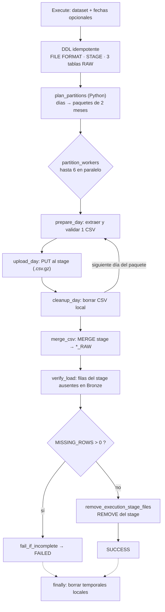

# 2. Ingesta con Kestra

[← Arquitectura](01_arquitectura.md) · [Índice](README.md) · **Ingesta** · [Siguiente: Calidad de datos →](03_calidad_de_datos.md)

Código: [`src/main/kestra/flows/bronze_ingestion.yml`](../src/main/kestra/flows/bronze_ingestion.yml)
y [`prepare_bronze.py`](../src/main/kestra/flows/prepare_bronze.py).

## Fuente y granularidad

| Dataset (input `dataset`) | Archivo en `src/res/data/raw` | Contenido | Tabla Bronze |
| --- | --- | --- | --- |
| `smart_2018` | `smartlog2018ssd.zip` | Un CSV por día (`YYYYMMDD.csv`), 105 columnas | `SMART_2018_RAW` |
| `smart_2019` | `smartlog2019ssd.zip` | Igual, para 2019 | `SMART_2019_RAW` |
| `failure_labels` | `ssd_failure_label.csv.zip` | Un CSV con `model`, `failure_time` y `disk_id` | `SSD_FAILURE_LABEL_RAW` |

- **Granularidad de la fuente:** una fila es la telemetría SMART de un disco en un día. Las
  etiquetas tienen una fila por falla.
- **Granularidad de Bronze:** una fila de Bronze es una fila de un CSV. Su clave natural es
  `(SOURCE_ARCHIVE, SOURCE_FILE, SOURCE_ROW)`.
- **Volumen:** 135,8 millones de filas en 2018 y 137,3 millones en 2019. Un año descomprimido
  ocupa alrededor de 38 GiB.

## Proceso de carga



1. **Validar antes de cargar** (`prepare_bronze.py`). Antes de subir nada se exigen la cabecera
   exacta (105 columnas en el mismo orden), que no haya columnas repetidas, que cada fila tenga
   el mismo número de campos que la cabecera, que el texto sea UTF-8 válido y que los nombres de
   archivo tengan fecha. Además se ignora la basura que deja macOS en el ZIP
   (`__MACOSX/._ssd_failure_label.csv`). Cualquier anomalía hace fallar la tarea.
2. **Agregar linaje.** Cada fila se reescribe con el archivo ZIP de origen, el CSV, el número de
   línea y la fecha.
3. **Subir.** Se hace `PUT` al *stage* interno con compresión gzip, en la ruta
   `kestra/<execution.id>/<dataset>/<día>/`. Cada ejecución tiene su carpeta propia, así que dos
   ejecuciones no se pisan.
4. **Integrar.** Un solo `MERGE` lee los archivos de esa ejecución, construye el `VARIANT` con
   `OBJECT_CONSTRUCT_KEEP_NULL` (todo como texto y con `NULLIF('')`) y calcula
   `SHA2(TO_JSON(...))`.
5. **Reconciliar.** Un `LEFT JOIN` cruza el *stage* con la tabla destino. Si falta una sola fila,
   la ejecución termina en `FAILED`.

**Por qué paquetes de 2 meses, 6 en paralelo y días en secuencia:** 12 meses entre 2 dan 6
*workers*, así que un año completo se procesa en paralelo. Dentro de cada *worker* los días van
uno por uno y el CSV local se borra apenas se sube, de modo que en disco solo existen como máximo
6 CSV diarios a la vez y nunca el año completo.

## Trigger y frecuencia

Hay tres flows en el namespace `ssd_failure_prediction`. Todos se importan solos al levantar
Docker, gracias al servicio `kestra-flow-sync`.

| Flow | Trigger | Qué hace |
| --- | --- | --- |
| [`bronze_daily_schedule`](../src/main/kestra/flows/bronze_daily_schedule.yml) | **`Schedule` diario a las 03:00** (`cron: "0 3 * * *"`) | Carga el **día anterior** a la fecha programada, llamando a `bronze_ingestion` como *subflow* |
| [`bronze_ingestion`](../src/main/kestra/flows/bronze_ingestion.yml) | Llamado por los otros dos flows, o manual | Carga un dataset completo o un rango de fechas |
| [`ssd_pipeline`](../src/main/kestra/flows/ssd_pipeline.yml) | **`Schedule` semanal, lunes 06:00**, o manual | Ingesta opcional → `dbt build` (modelos + tests) → OBT |

- **Por qué diario:** la fuente genera **un archivo SMART por día**, así que el lote diario es la
  unidad natural. Ejecutar más seguido no traería datos nuevos.
- **Por qué la transformación es semanal:** reconstruir Silver/Gold y la OBT completa cada día
  costaría cómputo de Snowflake sin cambiar decisiones, porque el horizonte de predicción es de
  30 días (ver [batch vs. streaming](06_batch_vs_streaming.md)). Se puede ejecutar a mano en
  cualquier momento.
- **Dataset histórico:** Tianchi solo cubre 2018–2019. Cuando el tick diario cae en una fecha
  sin archivo (por ejemplo, la de hoy), el flow registra "sin datos" y termina en `SUCCESS` en
  vez de fallar todos los días. Con una fuente viva bastaría con quitar esa condición.
- **Única acción manual:** dejar los ZIP en `src/res/data/raw`. Tianchi exige iniciar sesión y
  no tiene API, así que la descarga no se puede automatizar.
- `concurrency.limit: 1` en los tres flows: nunca hay dos cargas sobre las mismas tablas; las
  ejecuciones extra quedan en cola.

## Manejo de errores y retries

| Tipo de error | Ejemplo | Tratamiento | Por qué |
| --- | --- | --- | --- |
| Transitorio de Snowflake | red caída, timeout, warehouse suspendido | `retry` exponencial en **todas** las tareas Snowflake | Suele resolverse solo; reintentar es seguro porque todo es idempotente |
| Determinista de la fuente | falta el ZIP, cambió el esquema, fila corrupta, fechas mal escritas | **Sin retry**: falla de inmediato | Reintentar daría el mismo error; hay que corregir la fuente |
| Carga incompleta | filas del *stage* que no llegaron a Bronze | `fail_if_incomplete` marca la ejecución como `FAILED` | Sin esta tarea el flow terminaría en `SUCCESS` aunque faltaran datos |

Parámetros de retry:

| Tareas | Espera inicial | Espera máxima | Intentos | Duración máxima |
| --- | --- | --- | --- | --- |
| DDL (formato, stage, tablas) | 10 s | 1 min | 4 | 10 min |
| `upload_day` (PUT) y `verify_load` | 15 s | 2 min | 4 | 30 min |
| `merge_csv` | 30 s | 5 min | 3 | 2 h |

Con `warningOnRetry: true`, una ejecución que necesitó reintentos queda en estado `WARNING` en
vez de `SUCCESS`. El problema queda visible aunque se haya recuperado.

**Limpieza:**

- Después de reconciliar, `remove_execution_stage_files` borra con `REMOVE` los archivos de esa
  ejecución en el *stage*. Si la ejecución falla antes, se conservan para investigar.
- El bloque `finally` borra **siempre** los CSV temporales locales, aunque la ejecución haya
  fallado a mitad de camino.

**Orquestación (`ssd_pipeline`):** si falla la ingesta, no se ejecuta dbt; si falla un modelo o
un test de dbt (por ejemplo, un duplicado que rompe el grain), no se construye la OBT. `dbt_build`
tiene un reintento por si el error es transitorio, y el bloque `errors` deja el fallo registrado
en el log.

## Backfill de datos históricos

Hay dos formas, y ambas son seguras de repetir:

1. **Backfill nativo de Kestra sobre el trigger diario:** en la UI, *Flows →
   bronze_daily_schedule → Triggers → Backfill executions*, con inicio `2018-01-02` y fin
   `2020-01-01`. Kestra crea una ejecución por cada tick diario pasado, y cada una carga el día
   anterior: así se recorre 2018-01-01 … 2019-12-31 día por día, en cola y en orden.
2. **Por rango, en una sola ejecución:** se ejecuta `bronze_ingestion` (o `ssd_pipeline`) con
   `requested_start_date` y `requested_end_date` (`YYYY-MM-DD`, inclusivos). Si se dejan vacíos,
   se carga el año completo, en paralelo por bimestres.

En los dos casos el `MERGE` es **idempotente**. Su clave es
`(SOURCE_ARCHIVE, SOURCE_FILE, SOURCE_ROW)`:

- una fila nueva se **inserta**;
- una fila igual (mismo `SOURCE_SHA256`) **no se toca**, así que recargar no duplica nada;
- una fila con contenido distinto se **actualiza** y se renueva su `INGESTED_AT`.

Además, **nunca hay `DELETE`**: si una versión posterior del archivo omite una fila, Bronze
conserva la histórica. Silver detecta solo lo nuevo con su filtro incremental
`INGESTED_AT > max(bronze_ingested_at)`.

Ejemplo: recargar la primera semana de marzo de 2019.

```text
flow = bronze_ingestion
dataset = smart_2019
requested_start_date = 2019-03-01
requested_end_date   = 2019-03-07
```

## Por qué Bronze guarda `VARIANT` con texto

Si se tipara al cargar, un valor que no convierte (por ejemplo `"abc"` en un campo numérico)
haría fallar la carga o se perdería. Con texto dentro de un `VARIANT`, Bronze es una copia fiel
de la fuente y el tipado se hace en Silver con `TRY_TO_*`. Si en el futuro cambia una regla, se
puede reprocesar desde Bronze sin volver a descargar los ZIP.
