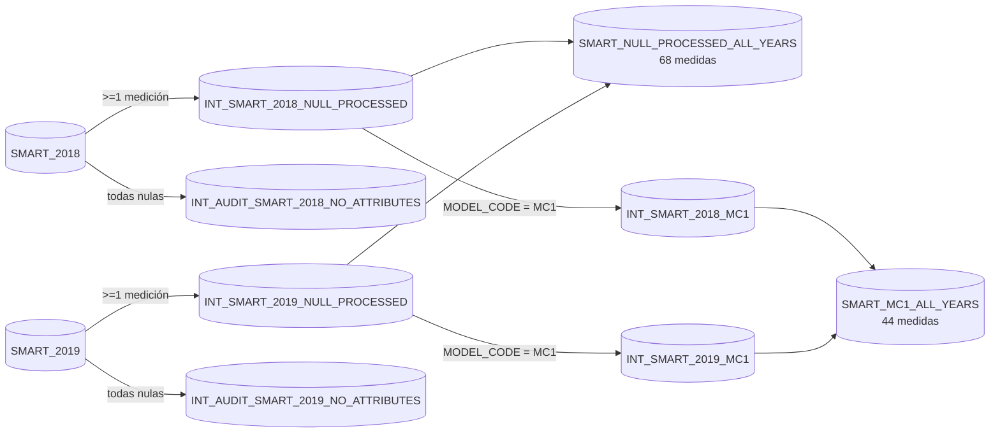
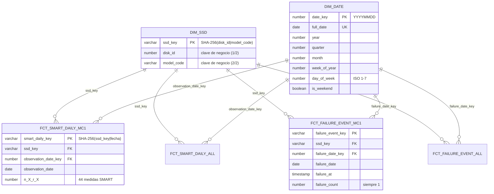

# 4. Transformaciones y modelado (dbt)

[← Calidad de datos](03_calidad_de_datos.md) · [Índice](README.md) · **Modelado** · [Siguiente: Spark y OBT →](05_spark_obt.md)

Proyecto dbt: [`src/main/dbt/ssd_failure_prediction`](../src/main/dbt/ssd_failure_prediction).

## Bronze → Silver → Gold

| Capa | Quién la construye | Materialización | Qué contiene |
| --- | --- | --- | --- |
| **Bronze** | Kestra | Tablas `*_RAW` (con `MERGE`) | El dato original como texto en `RAW_RECORD` (`VARIANT`) + linaje |
| **Silver base** | dbt | `incremental` + `merge` por `silver_record_id` | Tipado de 105 campos; una fila por fila de Bronze; sin filtrar |
| **Silver procesada** | dbt | `table` | Política de nulos, cuarentena, subconjunto MC1 y unión de años |
| **Gold** | dbt | `table` | Star schema: 2 dimensiones y 4 hechos |

### Silver

- **Silver base** (`smart_2018.sql`, `smart_2019.sql`, `ssd_failure_labels.sql`):
  - `silver_record_id = SHA-256(archivo | CSV | fila)` es la clave estable y la `unique_key` del
    `MERGE` incremental.
  - `raw_record:campo::varchar` extrae del `VARIANT`, y `TRY_TO_*` tipa sin romper la carga.
  - En modo incremental solo procesa filas de Bronze con `INGESTED_AT` mayor al último cargado.
- **Por qué los años se procesan por separado y después se unen con `UNION ALL`:** cada año
  tiene su propia auditoría y sus tests; una vez que los esquemas son idénticos, `UNION ALL` no
  deduplica ni agrega nada, y el test de reconciliación lo comprueba.
- **Macros:** las listas de atributos (51 en total, 17 vacíos globales, 12 vacíos en MC1) están
  definidas **una sola vez** en
  [`secondary_silver_smart_columns.sql`](../src/main/dbt/ssd_failure_prediction/macros/secondary_silver_smart_columns.sql)
  y las usan tanto los modelos como los tests.

### Gold: star schema

| Tabla | Tipo | **Grain** (una fila =) | Fuente |
| --- | --- | --- | --- |
| `DIM_SSD` | Dimensión | un SSD físico `(disk_id, model_code)` | SMART procesado ∪ etiquetas |
| `DIM_DATE` | Dimensión | un día calendario, sin huecos, del primer al último día con datos | fechas de observación ∪ fechas de falla |
| `FCT_SMART_DAILY_ALL` | Hecho | **un SSD en un día de observación** (todos los modelos, 68 medidas) | `SMART_NULL_PROCESSED_ALL_YEARS` |
| `FCT_SMART_DAILY_MC1` | Hecho | **un SSD MC1 en un día de observación** (44 medidas) | `SMART_MC1_ALL_YEARS` |
| `FCT_FAILURE_EVENT_ALL` | Hecho | una falla confirmada | `SSD_FAILURE_LABELS` |
| `FCT_FAILURE_EVENT_MC1` | Hecho | una falla confirmada de un SSD MC1 | `SSD_FAILURE_LABELS` (MC1) |

**Decisiones del modelo dimensional:**

- **Las dimensiones son conformadas.** Los hechos de todos los modelos y los de MC1 comparten
  `DIM_SSD` y `DIM_DATE`, así que un análisis puede pasar de una población a otra sin cambiar el
  significado de las claves.
- **Claves sustitutas con hash (SHA-256) en vez de autoincrementales:** son deterministas, de
  modo que reconstruir Gold produce exactamente las mismas claves y la OBT no se desalinea.
- **Hecho de fallas separado del hecho SMART:** un disco puede fallar un día en que no reportó
  telemetría. Ese evento no tiene una fila SMART a la que pegarse.
- **`failure_count = 1`:** medida aditiva para sumar fallas por fecha, mes o modelo.
- **`DIM_DATE` continua** (`array_generate_range` + `flatten`): los días sin eventos también
  existen, así que los conteos por día muestran ceros reales en vez de días ausentes.
- **El linaje operativo (archivo, hash, fila) se queda en Silver.** Gold solo lleva contexto
  analítico.

## `source()` y `ref()`

- `source('bronze', 'smart_2018_raw')` apunta a tablas que dbt no construye (las carga Kestra);
  están declaradas en
  [`models/sources/sources.yml`](../src/main/dbt/ssd_failure_prediction/models/sources/sources.yml).
- Todos los demás modelos usan `ref('modelo')`. dbt arma el DAG con esas referencias y construye
  en orden: Silver base → procesada → final → dimensiones → hechos.

## Tests: reglas reales del dato y del negocio

| Regla | Test | Dónde |
| --- | --- | --- |
| Cada fila de Silver es única | `unique` + `not_null` en `silver_record_id` | `silver/schema.yml` |
| Las columnas obligatorias se tiparon bien | `not_null` en `disk_id`, `observation_date`, `model_code`, `failure_at`… | `silver/schema.yml` |
| La fecha de la fila coincide con la del archivo y con el año | `silver_smart_<año>_date_consistency` | `tests/` |
| Las fallas caen en 2018–2019 | `silver_failure_label_date_validity` | `tests/` |
| La limpieza no pierde filas | `smart_source_partition_reconciles`, `smart_year_union_reconciles` | `silver/smart/schema.yml` |
| Tabla limpia sin filas vacías; auditoría solo con filas vacías | `at_least_one_retained_smart_attribute_is_present`, `all_retained_smart_attributes_are_null` | `silver/smart/schema.yml` |
| Las columnas eliminadas no existen | `smart_columns_absent` | `silver/smart/schema.yml` |
| El subconjunto MC1 solo contiene MC1 | `accepted_values: [MC1]`, `fact_ssd_model_is` | Silver y Gold |
| **Grain** de los hechos | `unique_column_combination: [ssd_key, observation_date]`, `unique` en la PK | `gold/schema.yml` |
| **Integridad referencial** | `relationships` de `ssd_key` → `DIM_SSD` y de `*_date_key` → `DIM_DATE` | `gold/schema.yml` |
| Los joins no pierden ni duplican filas | `gold_row_count_matches_source` | `gold/schema.yml` |
| El calendario no tiene huecos | `continuous_date_spine` | `gold/schema.yml` |
| Toda falla está en `DIM_SSD` | `ssd_dimension_covers_source` | `gold/schema.yml` |
| `r_X` y `n_X` son nulos a la vez | `smart_pair_missingness_matches` | `gold/schema.yml` |
| Un SSD con dos fallas el mismo día | `unique_column_combination` con `severity: warn` | `gold/schema.yml` (avisa, no bloquea) |

Un test de dbt **pasa si su query devuelve 0 filas**. Los tests genéricos propios están en
[`macros/secondary_silver_tests.sql`](../src/main/dbt/ssd_failure_prediction/macros/secondary_silver_tests.sql)
y [`macros/gold_tests.sql`](../src/main/dbt/ssd_failure_prediction/macros/gold_tests.sql).
