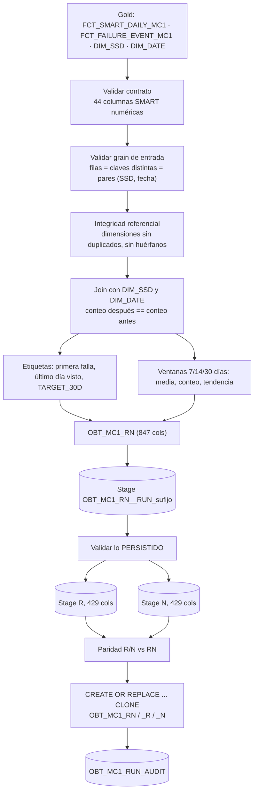

# 5. Spark y OBT

[← Modelado](04_modelado_dbt.md) · [Índice](README.md) · **Spark y OBT** · [Siguiente: Batch vs. streaming →](06_batch_vs_streaming.md)

Código: [`src/main/python/spark/jobs/build_mc1_obt.py`](../src/main/python/spark/jobs/build_mc1_obt.py)
(contenedor `snowpark-connect`).

## Cómo se construyó

El job usa la **API de DataFrames de PySpark** a través de **Snowpark Connect**. El código es
Spark, pero el plan se ejecuta dentro del warehouse de Snowflake
(`SNOWFLAKE_WAREHOUSE_HIGH_COMPUTE`). Así se evita descargar unos 115 millones de filas MC1 a un
contenedor local.

## Grain

**Una fila = un SSD MC1 en un día de observación.** Es el mismo grain que
`FCT_SMART_DAILY_MC1`, así que la OBT debe tener **exactamente** el mismo número de filas que el
hecho Gold (dentro del rango pedido).

## Columnas

| Bloque | Columnas | Detalle |
| --- | ---: | --- |
| Identidad | 6 | `SMART_DAILY_KEY`, `SSD_KEY`, `DISK_ID`, `MODEL_CODE`, `OBSERVATION_DATE_KEY`, `OBSERVATION_DATE` |
| Features | 836 (RN) / 418 (R o N) | 22 atributos × 19 columnas × representación (R raw, N normalizada) |
| Etiqueta | 5 | `FIRST_FAILURE_DATE`, `LAST_SEEN_DATE`, `DAYS_TO_FAILURE`, `LABEL_STATUS`, `TARGET_30D` |

Las 19 columnas por atributo, por ejemplo para `R_5` (sectores reasignados):

| Columna | Significado |
| --- | --- |
| `R_5` | valor del día |
| `R_5_MEAN_{7,14,30}D` | media móvil de la ventana actual (hoy y los N−1 días previos) |
| `R_5_COUNT_{7,14,30}D` | días con valor no nulo en la ventana actual |
| `R_5_PREV_COUNT_{7,14,30}D` | lo mismo en la ventana anterior (los N días previos a la actual) |
| `R_5_MEAN_VALID_{7,14,30}D` | 1 si la media actual existe |
| `R_5_MEAN_SHIFT_{7,14,30}D` | media actual − media anterior: **tendencia o degradación** |
| `R_5_MEAN_SHIFT_VALID_{7,14,30}D` | 1 si las dos ventanas tienen datos |

- Las ventanas son por **rango de días** (`rangeBetween` sobre el número de día), no por número
  de filas. Si un disco no reporta algunos días, la ventana sigue cubriendo el período calendario
  correcto.
- `avg` y `count` ignoran los `NULL`. Se mantiene la decisión de Silver de **no imputar**.

## Etiqueta (`TARGET_30D`)

| `LABEL_STATUS` | Condición | `TARGET_30D` |
| --- | --- | --- |
| `POST_FAILURE` | observación posterior a la primera falla | `NULL` (no se usa) |
| `SAME_DAY_FAILURE` | observación el mismo día de la falla | `NULL` (no da anticipación) |
| `POSITIVE` | la falla ocurre entre 1 y 30 días después | **1** |
| `NEGATIVE` | el SSD sigue observado 30 días o más después y no falló en ese lapso | **0** |
| `CENSORED` | no hay suficiente futuro observado para saberlo | `NULL` (no se usa) |

`CENSORED` evita etiquetar como "sano" a un disco del que simplemente se dejó de tener datos. Si
un SSD tiene varias fallas, se usa la **primera**, y el job lo deja registrado en el log y en la
auditoría (`MULTIPLE_FAILURE_SSD_COUNT`).

## Validación de los joins y del número de observaciones

| Validación | Qué evita |
| --- | --- |
| `validate_source_grain`: filas = `SMART_DAILY_KEY` distintas = pares `(SSD_KEY, fecha)` distintos | Construir sobre un Gold con duplicados |
| `validate_dimension_relationships`: `DIM_SSD` y `DIM_DATE` sin claves repetidas, sin hechos huérfanos (`left_anti`) | Que un join **multiplique** filas por claves duplicadas o **pierda** filas sin pareja |
| `build_base_observations`: **conteo después del join == conteo antes** | Es la prueba directa de que el enriquecimiento no cambió el número de observaciones |
| `validate_rn_stage` sobre la tabla **ya escrita**: filas = filas de Gold, sin claves ni pares duplicados, conteos de ventana entre 0 y N, medias y tendencias coherentes, etiquetas recalculadas iguales, solo MC1, sin `DISK_ID` ni `LAST_SEEN_DATE` nulos | Errores que solo aparecen al materializar |
| `validate_variant_stage` + `validate_variant_parity` (`exceptAll` en ambos sentidos) | Que R o N tengan filas distintas de RN |

Si alguna validación falla, el job **no publica**: las tablas finales anteriores quedan intactas,
se escribe una fila `FAILED_VALIDATION` en `OBT_MC1_RUN_AUDIT` y el proceso termina con código 2.

**Publicación con `CLONE`:** las tablas *stage* validadas se copian a las finales con
`CREATE OR REPLACE TABLE ... CLONE`. Es una copia *zero-copy* e instantánea, así que nadie lee
nunca una OBT a medio escribir.

## Por qué tres variantes (RN, R, N)

`R` (raw) y `N` (normalizado por el fabricante) son dos representaciones del mismo atributo. Su
relación numérica no se pudo reconstruir con los exportes agregados del EDA (ver
[limitaciones](07_limitaciones.md)). Tener las tres variantes permite comparar en la etapa de
modelado si conviene usar una, la otra o ambas, sin recalcular ventanas: R y N son proyecciones
de la misma tabla RN.

## Star schema frente a OBT en este proyecto

| Uso | Estructura | Por qué |
| --- | --- | --- |
| Análisis exploratorio y reportes (fallas por mes, comparación entre modelos, tasa de falla por año) | **Star schema (Gold)** | Las dimensiones conformadas permiten agregar por cualquier eje sin duplicar datos; los facts siguen siendo reutilizables |
| Entrenamiento y scoring del modelo predictivo MC1 | **OBT** | El modelo necesita una fila por observación con todas las features y la etiqueta ya calculadas, sin joins ni ventanas en el momento de entrenar |
| Agregar un modelo de SSD nuevo o cambiar la definición de la etiqueta | Se cambia en Gold/Spark y se regenera la OBT | La OBT es un derivado desechable: se reconstruye desde Gold |
