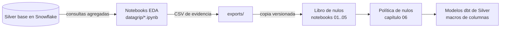

# 10. Notebooks: EDA en Spark y análisis de nulos

[← Mapa del código](09_mapa_del_codigo.md) · [Índice](README.md) · **Notebooks**

Hay **dos familias** de notebooks, con propósitos y entornos distintos:

| | EDA en Spark (`datagrip/`) | Libro de análisis de nulos (`ssd_null_analysis_book/`) |
| --- | --- | --- |
| Pregunta que responde | ¿Cómo son los datos de Silver base? (distribuciones, nulos, duplicados, identidad de discos) | ¿Qué política de nulos se justifica con esa evidencia? |
| Lee de | **Snowflake** (tablas `S_CDATOS_PSET2_SILVER.SMART_2018/2019` y `SSD_FAILURE_LABELS`) | **CSV ya agregados** en `ssd_null_analysis_book/exports/` |
| Kernel | `PySpark 4 + Snowflake` (contenedor `spark`) | Python normal (`pip install -r requirements.txt`) |
| Necesita credenciales | Sí | No: cualquiera puede reproducirlo |
| Produce | Tablas, gráficos y **CSV de evidencia** en `notebooks/exports/` | Conclusiones (capítulos `docs/01..07`) que se implementaron en dbt |



## Parte A: notebooks de EDA en Spark

### Cómo se ejecutan

1. Levantar el contenedor: `docker compose --env-file src/res/env/.env up -d spark`.
2. Abrir <http://127.0.0.1:4041> con el `JUPYTER_TOKEN` del `.env`. También se puede conectar
   DataGrip o VS Code al Jupyter remoto con esa URL y ese token.
3. Elegir el kernel **`PySpark 4 + Snowflake`**. El kernel genérico de Python no tiene Spark, el
   conector ni `snowflake_io`.
4. Ejecutar las celdas en orden. Las de menú piden por teclado el número de una variable.

Los `.ipynb` **no se editan a mano**: se generan con un script. Para cambiar una celda, se edita
el generador y se regenera:

```bash
python3 src/main/python/spark/notebooks/build_eda_smart2018_notebook.py --year 2018   # o --year 2019
python3 src/main/python/spark/notebooks/build_eda_failure_labels_notebook.py
```

`build_eda_smart2018_notebook.py` sirve para los dos años: con `--year 2019` reemplaza "2018"
por "2019" en todas las celdas.

### La idea central: Spark como cliente y Snowflake como motor

Silver tiene unos 136 millones de filas por año, y el contenedor tiene 2 GB de memoria. Por eso
**ninguna celda descarga la tabla**: cada análisis es una **consulta SQL agregada que se ejecuta
en Snowflake**, y a Spark y pandas solo llega el resultado, de decenas o miles de filas.

```python
# celda 3: los 3 helpers que usan todas las demás celdas
def snowflake_query(query):          # ejecuta el SQL en Snowflake vía el conector de Spark
    return read_snowflake_query(spark, query, schema=SMART_SCHEMA)

def aggregate_to_pandas(query):      # SOLO para resultados pequeños (agregados)
    return snowflake_query(query).toPandas()

def quote_identifier(value):         # lista blanca: solo acepta columnas conocidas
    if value not in ANALYSIS_COLUMNS: raise ValueError(...)   # evita inyección SQL
    return '"' + value + '"'
```

`read_snowflake_query` (en [`lib/snowflake_io.py`](../src/main/python/spark/lib/snowflake_io.py))
usa el conector `spark-snowflake` con `autopushdown=on`: el `SELECT ... GROUP BY` completo viaja a
Snowflake. **Regla:** nunca hacer `toPandas()` sobre la tabla SMART completa.

### Notebook SMART (2018 / 2019): sección por sección

| Sección | Qué calcula | Cómo (SQL en Snowflake) | Para qué sirvió |
| --- | --- | --- | --- |
| **0. Configuración** | Constantes: tabla, 51 atributos → 102 columnas, límites de muestreo, carpeta de exportes | — | `ANALYSIS_YEAR` y `COMPARISON_YEAR = 4037 − año` (2018 ↔ 2019) permiten comparar años en el mismo notebook |
| **1. Univariado** | Para la variable elegida: conteo, nulos, %, mín, Q1, media, mediana, Q3, máx, desviación y varianza; boxplot e histograma | `COUNT_IF(x IS NULL)`, `APPROX_PERCENTILE`, `STDDEV_SAMP`; el histograma usa `WIDTH_BUCKET(x, min, max, 40)` + `GROUP BY` | Ver rangos y asimetría de cada atributo SMART. Los cuartiles son aproximados (`APPROX_PERCENTILE`) para que la consulta sea viable con cientos de millones de filas |
| **2. Interacción de 2 variables** | Covarianza, correlación de Pearson, pendiente e intercepto de la regresión y un gráfico *hexbin* | `COVAR_SAMP`, `CORR`, `REGR_SLOPE`, `REGR_INTERCEPT` sobre **todas** las filas; el gráfico usa `SAMPLE BERNOULLI (0.05) SEED (2018)` con un máximo de 10.000 puntos | Relación entre `r_X` y `n_X` y entre atributos. La muestra con semilla es reproducible y solo se usa para dibujar; las estadísticas son exactas |
| **3. Patrones de nulos** | (a) ranking de columnas con nulos, (b) **combinaciones exactas de columnas nulas** por fila, (c) filas según cuántas columnas tienen nulas | Por fila: `ARRAY_CONSTRUCT_COMPACT(IFF(col IS NULL, 'col', NULL), ...)` arma la lista de columnas nulas; después `GROUP BY` sobre esa lista | **Evidencia clave**: 4.705 combinaciones en 2018; el 97 % de las filas tiene 60/62/64/66 nulos; R y N siempre nulos juntos |
| **3.1 Por modelo** | Top 10 de patrones de nulos por `MODEL_CODE`, % dentro del modelo, cobertura acumulada y qué parte del patrón pertenece a ese modelo | `SHA2(TO_JSON(patrón))` como id del patrón; ventanas `SUM() OVER (PARTITION BY ...)` y `ROW_NUMBER()` | Mostró que los nulos son **estructurales por modelo** (un patrón cubre ≥ 99 % de MC1) y no ruido aleatorio |
| **3.2 Disponibilidad en MC1** | Por atributo, nulos y presentes de R y N en MC1, si R y N coinciden siempre, y columnas 100 % nulas en MC1 pero presentes en otros modelos | `COUNT_IF(MODEL_CODE = 'MC1' AND col IS NULL)`, todo en **una sola** consulta con cientos de expresiones | Encontró los **12 atributos** que MC1 nunca reporta y que se quitan del esquema MC1 |
| **3.3 Patrones MC1 y comparación de años** | Ranking exacto de patrones en MC1 con cobertura acumulada; los mismos ids de patrón en 2018 y 2019 | `UNION ALL` de ambos años + `ROW_NUMBER() OVER (PARTITION BY año)` | El patrón dominante de MC1 es **el mismo** en los dos años (99,76 % y 99,97 %) |
| **3.4 Riesgo de falla (exploratorio)** | Tasa de falla a 30 días por patrón de nulos y por "columna nula vs. presente" | `TARGET_30D` provisional: `EXISTS (falla del mismo disco y modelo entre el día +1 y el +30)`; solo se usan observaciones con 30 días de seguimiento dentro del año con etiquetas | Mostró que el patrón dominante **no** predice la falla: su tasa es igual a la línea base del año. Por eso no se crean *features* de "patrón de nulos" |
| **4. Discos y modelos** | Top 50 discos por número de registros; registros y discos por modelo, con MC1 resaltado | `GROUP BY DISK_ID` / `GROUP BY MODEL_CODE`, `COUNT(DISTINCT ...)` | Tamaño de la población MC1 frente a otros modelos |
| **4.5.1 Identidad del disco** | `DISK_ID` asociados a más de un modelo, en un año y entre años | `HAVING COUNT(DISTINCT MODEL_CODE) > 1`, `LISTAGG` | **115.017** ids repetidos entre modelos: la clave del SSD debe ser `(disk_id, model_code)` |
| **4.5.2 Duplicados por grain** | Más de una fila para `(DISK_ID, MODEL_CODE, OBSERVATION_DATE)` | `GROUP BY` del grain + `HAVING COUNT(*) > 1` | **0 duplicados**: confirma el grain "un SSD en un día" de Gold |
| **4.5.3 Duplicados exactos** | Filas que chocan en el grain y además tienen las 102 columnas SMART idénticas | `GROUP BY` del grain + todas las columnas SMART (sin linaje) | **0**: no hay cargas duplicadas |
| **5. Cierre** | `spark.stop()` | — | Libera la sesión |

Cada sección guarda su resultado en `notebooks/exports/<año>_*.csv`, que se monta en el host. Esos
CSV son la evidencia que usan el libro de nulos y la sección de [calidad de datos](03_calidad_de_datos.md).

### Notebook de etiquetas de falla

Mismo patrón, adaptado a una tabla de eventos (`SSD_FAILURE_LABELS`, 16.305 filas):

| Sección | Qué hace |
| --- | --- |
| 1. Univariado | Distribución de `DISK_ID`, `MODEL_CODE`, `FAILURE_DATE` o `FAILURE_AT` (las fechas se agrupan por día) |
| 2. Interacción | Tabla de contingencia de dos variables, con gráfico de barras y *heatmap* |
| 3. Nulos | Mismo análisis de combinaciones de nulos: **0 nulos** en todas las columnas |
| 4. Distribuciones | Fallas por disco, por modelo (MC1 resaltado) y **línea de tiempo diaria** de fallas |

## Parte B: libro de análisis de nulos

### Qué es y por qué existe

Es un paquete **autocontenido**: 5 notebooks pequeños de pandas, 7 capítulos de interpretación y
los CSV de evidencia (con sus hashes SHA-256 en `exports/README.md`). Separa **el cálculo pesado**,
hecho una vez en Snowflake con los notebooks de EDA, del **razonamiento**, que cualquiera puede
reproducir en segundos sin credenciales:

```bash
cd src/main/python/spark/notebooks/ssd_null_analysis_book
pip install -r requirements.txt
jupyter lab notebooks/
```

Todos los notebooks leen de `../exports` y empiezan con los mismos helpers: `load_csv`,
`drop_export_index` (quita la columna de índice que pandas agregó al exportar) y `attr_id` (extrae
el número de atributo de `R_187` → `187`).

### Notebook por notebook

| Notebook | Capítulo | Qué comprueba | Resultado |
| --- | --- | --- | --- |
| `01_validate_exports` | [01](../src/main/python/spark/notebooks/ssd_null_analysis_book/docs/01_data_inventory_and_validation.md) | Que los CSV sean coherentes: etiquetas sin nulos; en cada patrón, si `R_x` es nulo entonces `N_x` también (`pair_mismatch_summary`) | Etiquetas completas; **0 patrones** con R y N desparejados → los nulos van por atributo, no por columna |
| `02_global_null_structure` | [02](../src/main/python/spark/notebooks/ssd_null_analysis_book/docs/02_global_null_structure.md) | Atributos 100 % nulos en cada año y en ambos; concentración por número de nulos; patrones compartidos entre años (`canonical_pattern` ordena la lista para que el orden no importe) | **17 atributos** vacíos en ambos años; 211 solo vacío en 2018; filas totalmente nulas: 490.285 (2018) y 635 (2019) |
| `03_model_pattern_analysis` | [03](../src/main/python/spark/notebooks/ssd_null_analysis_book/docs/03_model_specific_missingness.md) | Cobertura del patrón dominante de cada modelo en 2018 y 2019; si el patrón de MC1 también aparece en otros modelos | Patrón dominante ≥ 99,4 % en casi todos los modelos; el patrón de MC1 lo comparte MC2, así que un patrón no identifica un modelo |
| `04_mc1_schema_analysis` | [04](../src/main/python/spark/notebooks/ssd_null_analysis_book/docs/04_mc1_schema_and_cross_year_stability.md) | Atributos que MC1 nunca reporta en ningún año; SMART 211 en MC1 2019; estabilidad del patrón dominante | **12 atributos** extra a quitar en MC1; 211 tiene 2.738 valores (99,9955 % nulo); el mismo patrón domina en ambos años |
| `05_mc1_failure_risk` | [05](../src/main/python/spark/notebooks/ssd_null_analysis_book/docs/05_failure_risk_interpretation.md) | Tasa de falla del patrón dominante frente a la línea base de MC1; patrones raros; nulo vs. presente por atributo (solo hay exporte de 2018) | Sin señal: 0,105243 % vs. 0,105071 % (2018) y 0,404120 % vs. 0,404121 % (2019). La línea base de MC1 se cuadruplica entre años → split temporal |

Los capítulos [06](../src/main/python/spark/notebooks/ssd_null_analysis_book/docs/06_silver_layer_and_modeling_policy.md)
y [07](../src/main/python/spark/notebooks/ssd_null_analysis_book/docs/07_reproducibility_and_limitations.md)
no tienen notebook: convierten la evidencia en la **política de Silver** (qué se quita, qué se pone
en cuarentena, qué no se imputa) y documentan sus límites.

### De la evidencia al código

| Conclusión del libro | Dónde quedó implementada |
| --- | --- |
| 17 atributos vacíos en ambos años | `globally_unavailable_smart_attribute_ids()` en [`secondary_silver_smart_columns.sql`](../src/main/dbt/ssd_failure_prediction/macros/secondary_silver_smart_columns.sql) |
| 12 atributos que MC1 no reporta | `mc1_unavailable_smart_attribute_ids()` (misma macro) y `SMART_IDS` en `build_mc1_obt.py` |
| Filas sin ninguna medición → cuarentena | `int_audit_smart_<año>_no_attributes.sql` |
| No imputar nulos parciales | `*_null_processed.sql` deja los `NULL`; en la OBT, `avg` y `count` los ignoran |
| R y N nulos juntos | Test `smart_pair_missingness_matches` en Gold |
| `disk_id` se repite entre modelos | Clave `(disk_id, model_code)` → `ssd_key` en `DIM_SSD` |
| Cambia la prevalencia entre años | `LABEL_STATUS = CENSORED` y validación temporal (etapa de modelado) |

## Preguntas frecuentes

- **¿Por qué hay una etiqueta `TARGET_30D` en el EDA si la OBT ya la define?** La del EDA (3.4)
  es **provisional y exploratoria**: se hizo antes de construir la OBT y solo usa los días con 30 de
  seguimiento dentro del año. La etiqueta oficial es la de
  [`build_mc1_obt.py`](05_spark_obt.md#etiqueta-target_30d), que además distingue los casos
  `CENSORED`, `SAME_DAY_FAILURE` y `POST_FAILURE`.
- **¿Por qué 4037 − año?** Es un truco para obtener "el otro año": 4037 − 2018 = 2019 y
  4037 − 2019 = 2018.
- **¿Las cifras de los capítulos están en inglés y las de `docs/` en español?** Son las mismas
  cifras; `docs/` las resume y las enlaza con el pipeline.
- **¿La "cobertura de fallas" (1.964 + 8.546) contradice las 16.305 etiquetas?** No. Ese exporte
  filtra `MODEL_CODE = 'MC1'` (celda 27 del notebook SMART): son las fallas de MC1, mientras que
  16.305 son las de todos los modelos.
