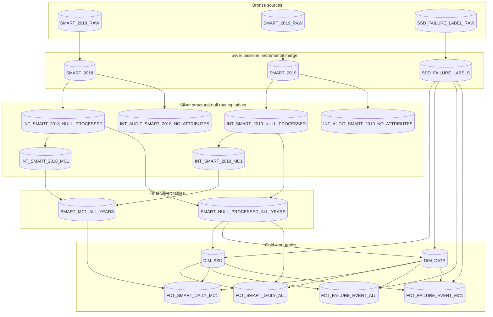

# SSD failure prediction dbt project

[Project home](../../../../README.md) · [Bronze ingestion](../../kestra/flows/README.md) · **dbt transformations** · [Silver](models/silver/README.md) · [Gold](models/gold/README.md) · [MC1 OBT](../../python/spark/jobs/README.md)

This dbt project turns source-preserving Bronze `VARIANT` rows into typed,
tested Silver relations and then into the conformed dimensions and facts used
by the Snowpark Connect MC1 feature-engineering job. SQL models define the
relations, Jinja macros centralize the SMART feature contracts, and generic and
singular tests enforce row conservation, key uniqueness, dimensional coverage,
and missingness rules.

## Warehouse boundaries

The database is supplied through the dbt profile; model code does not hardcode
an account or database. The project deliberately uses fixed custom schemas:

| Layer | Snowflake schema | Materialization policy |
| --- | --- | --- |
| Bronze source | `S_CDATOS_PSET2_BRONZE` | Managed by Kestra, read by dbt |
| Silver | `S_CDATOS_PSET2_SILVER` | Baseline models incremental; downstream Silver models tables |
| Gold | `S_CDATOS_PSET2_GOLD` | Tables |

[`generate_schema_name.sql`](macros/generate_schema_name.sql) returns the custom
schema name exactly, preventing dbt from prefixing it with the target schema.

## Complete model DAG



## Model catalog

All aliases below are the physical Snowflake relation names.

| dbt model | Physical relation | Grain | Materialization | Primary or tested key | Direct inputs |
| --- | --- | --- | --- | --- | --- |
| `smart_2018` | `SMART_2018` | One source CSV row / daily SSD observation | Incremental merge | `SILVER_RECORD_ID` | `SMART_2018_RAW` |
| `smart_2019` | `SMART_2019` | One source CSV row / daily SSD observation | Incremental merge | `SILVER_RECORD_ID` | `SMART_2019_RAW` |
| `ssd_failure_labels` | `SSD_FAILURE_LABELS` | One source failure-label row | Incremental merge | `SILVER_RECORD_ID` | `SSD_FAILURE_LABEL_RAW` |
| `int_smart_2018_null_processed` | `INT_SMART_2018_NULL_PROCESSED` | One retained 2018 daily observation | Table | `SILVER_RECORD_ID` | `SMART_2018` |
| `int_smart_2019_null_processed` | `INT_SMART_2019_NULL_PROCESSED` | One retained 2019 daily observation | Table | `SILVER_RECORD_ID` | `SMART_2019` |
| `int_audit_smart_2018_no_attributes` | `INT_AUDIT_SMART_2018_NO_ATTRIBUTES` | One quarantined 2018 observation | Table | `SILVER_RECORD_ID` | `SMART_2018` |
| `int_audit_smart_2019_no_attributes` | `INT_AUDIT_SMART_2019_NO_ATTRIBUTES` | One quarantined 2019 observation | Table | `SILVER_RECORD_ID` | `SMART_2019` |
| `int_smart_2018_mc1` | `INT_SMART_2018_MC1` | One retained 2018 MC1 daily observation | Table | `SILVER_RECORD_ID` | `INT_SMART_2018_NULL_PROCESSED` |
| `int_smart_2019_mc1` | `INT_SMART_2019_MC1` | One retained 2019 MC1 daily observation | Table | `SILVER_RECORD_ID` | `INT_SMART_2019_NULL_PROCESSED` |
| `smart_null_processed_all_years` | `SMART_NULL_PROCESSED_ALL_YEARS` | One retained daily observation across all models and both years | Table | `SILVER_RECORD_ID` | Both null-processed intermediates |
| `smart_mc1_all_years` | `SMART_MC1_ALL_YEARS` | One retained MC1 daily observation across both years | Table | `SILVER_RECORD_ID` | Both MC1 intermediates |
| `dim_ssd` | `DIM_SSD` | One `(DISK_ID, MODEL_CODE)` business key | Table | `SSD_KEY`; natural key `(DISK_ID, MODEL_CODE)` | Final all-model SMART and failure labels |
| `dim_date` | `DIM_DATE` | One calendar day in the continuous source range | Table | `DATE_KEY`; alternate key `FULL_DATE` | Final all-model SMART and failure labels |
| `fct_smart_daily_all` | `FCT_SMART_DAILY_ALL` | One SSD business key and observation date | Table | `SMART_DAILY_KEY`; unique `(SSD_KEY, OBSERVATION_DATE)` | Final all-model SMART plus dimensions |
| `fct_smart_daily_mc1` | `FCT_SMART_DAILY_MC1` | One MC1 SSD business key and observation date | Table | `SMART_DAILY_KEY`; unique `(SSD_KEY, OBSERVATION_DATE)` | Final MC1 SMART plus dimensions |
| `fct_failure_event_all` | `FCT_FAILURE_EVENT_ALL` | One source failure event | Table | `FAILURE_EVENT_KEY` | Failure labels plus dimensions |
| `fct_failure_event_mc1` | `FCT_FAILURE_EVENT_MC1` | One MC1 source failure event | Table | `FAILURE_EVENT_KEY` | Failure labels plus dimensions |

The layer READMEs provide the complete column dictionaries:

- [Silver model and column reference](models/silver/README.md)
- [Gold dimensional model and column reference](models/gold/README.md)

## Feature contracts implemented by macros

The raw SMART contract contains 51 attribute identifiers and therefore 102
`N_x`/`R_x` columns. Every SMART measure uses `NUMBER(38,6)` after tolerant
conversion with `TRY_TO_DECIMAL`.

| Contract | Attribute identifiers | Measure columns |
| --- | --- | ---: |
| Raw baseline | `1, 2, 3, 4, 5, 6, 7, 8, 9, 10, 11, 12, 13, 170, 171, 172, 173, 174, 177, 180, 181, 182, 183, 184, 187, 188, 189, 190, 191, 192, 193, 194, 195, 196, 197, 198, 199, 200, 204, 205, 206, 207, 211, 233, 240, 241, 242, 244, 245, 175, 232` | 102 |
| Globally unavailable and removed | `2, 3, 4, 6, 7, 8, 10, 11, 13, 189, 191, 193, 200, 204, 205, 207, 240` | 34 |
| All-model retained | `1, 5, 9, 12, 170, 171, 172, 173, 174, 177, 180, 181, 182, 183, 184, 187, 188, 190, 192, 194, 195, 196, 197, 198, 199, 206, 211, 233, 241, 242, 244, 245, 175, 232` | 68 |
| Additional MC1-unavailable and removed | `175, 177, 181, 182, 190, 192, 232, 233, 241, 242, 244, 245` | 24 |
| MC1 retained | `1, 5, 9, 12, 170, 171, 172, 173, 174, 180, 183, 184, 187, 188, 194, 195, 196, 197, 198, 199, 206, 211` | 44 |

The implementation deliberately preserves macro order rather than numerically
sorting identifiers. R/N pairs are generated in `N_x, R_x` order in Silver.

## Tests and enforced invariants

| Test | Scope | What a returned row means |
| --- | --- | --- |
| `not_null`, `unique`, `relationships`, `accepted_values` | Declared keys, dimensions, and enumerations | A standard dbt constraint is violated |
| `unique_column_combination` | SSD natural key and daily fact grain | More than one row exists at the intended grain |
| `continuous_date_spine` | `DIM_DATE` | Two adjacent dates differ by something other than one day |
| `ssd_dimension_covers_source` | `DIM_SSD` | A source `(DISK_ID, MODEL_CODE)` is absent from the dimension |
| `gold_row_count_matches_source` | All facts | A dimensional join filtered or multiplied source rows |
| `smart_fact_has_measurement` | SMART facts | A fact has no retained `R_x` or `N_x` measurement |
| `smart_pair_missingness_matches` | SMART facts | One side of an `R_x`/`N_x` pair is null while the other is present |
| `fact_ssd_model_is` | MC1 facts | The related dimension row is not MC1 |
| `smart_source_partition_reconciles` | Clean/audit split | The split loses or invents a baseline SMART row |
| `smart_year_union_reconciles` | Final Silver unions | The all-year table differs from the exact `UNION ALL` of its inputs |
| `smart_columns_absent` | Processed Silver | A structurally removed column still exists physically |
| `at_least_one_retained_smart_attribute_is_present` | Modeling lineage | A no-measurement row escaped quarantine |
| `all_retained_smart_attributes_are_null` | Audit lineage | A quarantined row contains a retained measurement |
| Singular date tests | Baseline Silver | A date lies outside its declared year or disagrees with `SOURCE_DATE` |

The `(SSD_KEY, FAILURE_DATE)` uniqueness checks on failure facts have warning
severity. `FAILURE_EVENT_KEY` remains the event key and can distinguish multiple
source label rows on the same date.

## Incremental behavior

The three baseline models use `MERGE` with `SILVER_RECORD_ID` as `unique_key`.
On incremental runs they read Bronze rows whose `INGESTED_AT` is greater than
the maximum `BRONZE_INGESTED_AT` already present. `on_schema_change='fail'`
prevents an unnoticed source-contract change. A full refresh is required when
historical Bronze rows were modified without receiving a later ingestion
timestamp or when transformation logic must be reapplied to every baseline row.

Downstream Silver and all Gold relations are rebuilt as tables so their
structural projections and joins reflect current baseline contents.

## Build and inspect

Run from the PSet root. Account-specific settings come from
`src/res/config/dbt/profiles/profiles.yml` and the private environment file.

```bash
# Connection and project checks.
docker compose --env-file src/res/env/.env run --rm --no-deps \
  --workdir /workspace/dbt-projects/ssd_failure_prediction dbt-ui-backend \
  /opt/dbt-ui/backend/.venv/bin/dbt debug \
  --profiles-dir /home/dbtui/.dbt

# Parse without executing warehouse SQL.
docker compose --env-file src/res/env/.env run --rm --no-deps \
  --workdir /workspace/dbt-projects/ssd_failure_prediction dbt-ui-backend \
  /opt/dbt-ui/backend/.venv/bin/dbt parse \
  --profiles-dir /home/dbtui/.dbt

# Build the complete lineage in dependency order.
docker compose --env-file src/res/env/.env run --rm --no-deps \
  --workdir /workspace/dbt-projects/ssd_failure_prediction dbt-ui-backend \
  /opt/dbt-ui/backend/.venv/bin/dbt build \
  --profiles-dir /home/dbtui/.dbt

# Layer-specific builds.
docker compose --env-file src/res/env/.env run --rm --no-deps \
  --workdir /workspace/dbt-projects/ssd_failure_prediction dbt-ui-backend \
  /opt/dbt-ui/backend/.venv/bin/dbt build \
  --profiles-dir /home/dbtui/.dbt --select tag:silver

docker compose --env-file src/res/env/.env run --rm --no-deps \
  --workdir /workspace/dbt-projects/ssd_failure_prediction dbt-ui-backend \
  /opt/dbt-ui/backend/.venv/bin/dbt build \
  --profiles-dir /home/dbtui/.dbt --select tag:gold
```

Use `dbt ls --select <selector>` before a selective build when you need to
confirm the exact DAG slice. Use `--full-refresh` only deliberately: it scans
and rebuilds the very large baseline telemetry tables.

After Gold passes, continue with the
[Snowpark Connect MC1 OBT job](../../python/spark/jobs/README.md).
