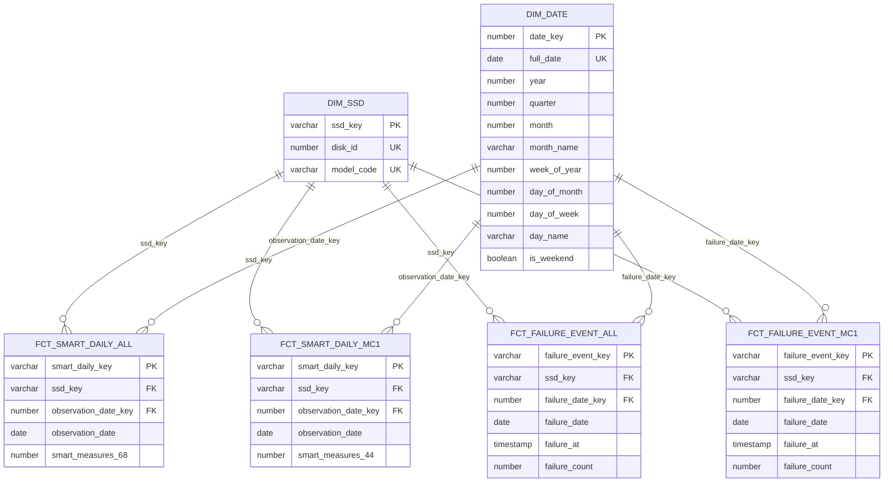

# Gold dimensional model

[Project home](../../../../../../README.md) · [dbt project](../../README.md) · [Silver](../silver/README.md) · **Gold** · [MC1 OBT](../../../../python/spark/jobs/README.md)

Gold converts the final Silver tables into a conformed star schema. It replaces
the Silver natural SSD identity with a deterministic surrogate key, adds a
continuous date dimension, preserves every retained SMART measure unchanged,
and keeps operational file/ingestion lineage in Silver.

## Star schemas

The all-model and MC1 facts share the same conformed dimensions. This allows an
analyst to select the broad population or the MC1-specialized population
without changing identity or calendar semantics.



`DISK_ID` alone is not a valid business key because censored serial identifiers
can appear under different manufacturers/models. The natural key is the pair
`(DISK_ID, MODEL_CODE)`. `SSD_KEY` is its deterministic SHA-256 representation
and is the only SSD foreign key carried by facts.

## Relation catalog

| Relation | Grain | Columns | Source | Purpose |
| --- | --- | ---: | --- | --- |
| `DIM_SSD` | One `(DISK_ID, MODEL_CODE)` pair | 3 | All-model SMART plus failure labels | Conformed SSD identity, including label-only SSDs |
| `DIM_DATE` | One calendar date from the minimum to maximum source date | 11 | Observation and failure dates | Gap-free conformed calendar |
| `FCT_SMART_DAILY_ALL` | One SSD key and observation date | 72 | `SMART_NULL_PROCESSED_ALL_YEARS` | Daily telemetry for all models with 68 measures |
| `FCT_SMART_DAILY_MC1` | One MC1 SSD key and observation date | 48 | `SMART_MC1_ALL_YEARS` | Daily MC1 telemetry with 44 measures |
| `FCT_FAILURE_EVENT_ALL` | One source failure-label event | 6 | `SSD_FAILURE_LABELS` | Failure events across all models |
| `FCT_FAILURE_EVENT_MC1` | One MC1 source failure-label event | 6 | `SSD_FAILURE_LABELS` filtered to MC1 | Failure events for the MC1 population |

All Gold models are physical tables. No Gold relation is a view or incremental
model, so every build reflects the current final Silver contents.

## `DIM_SSD` column dictionary

| Column | Type | Key role | Description |
| --- | --- | --- | --- |
| `SSD_KEY` | `VARCHAR` | Primary/tested unique key | SHA-256 of `DISK_ID` and `MODEL_CODE`, separated by `|` |
| `DISK_ID` | `NUMBER(38,0)` | Natural key component | Censored disk serial identifier |
| `MODEL_CODE` | `VARCHAR` | Natural key component | Censored manufacturer/model identifier |

The dimension takes the SQL `UNION` of business keys found in
`SMART_NULL_PROCESSED_ALL_YEARS` and `SSD_FAILURE_LABELS`. The union removes
duplicate key pairs while retaining SSDs that occur only in failure labels.
Coverage tests ensure both source populations are represented.

## `DIM_DATE` column dictionary

| Column | Type | Description |
| --- | --- | --- |
| `DATE_KEY` | `NUMBER(8,0)` | `YYYYMMDD` integer key |
| `FULL_DATE` | `DATE` | Unique calendar date |
| `YEAR` | `NUMBER` | Calendar year |
| `QUARTER` | `NUMBER` | Calendar quarter from 1 through 4 |
| `MONTH` | `NUMBER` | Calendar month from 1 through 12 |
| `MONTH_NAME` | `VARCHAR` | Snowflake abbreviated month name |
| `WEEK_OF_YEAR` | `NUMBER` | ISO week number |
| `DAY_OF_MONTH` | `NUMBER` | Day number within the month |
| `DAY_OF_WEEK` | `NUMBER` | ISO weekday number: Monday 1 through Sunday 7 |
| `DAY_NAME` | `VARCHAR` | Snowflake abbreviated weekday name |
| `IS_WEEKEND` | `BOOLEAN` | True for ISO weekday 6 or 7 |

The bounds come from the union of all final SMART observation dates and all
failure dates. `ARRAY_GENERATE_RANGE` fills every day between those bounds, so
dates with no telemetry still exist. `continuous_date_spine` verifies that
adjacent rows are exactly one day apart.

## SMART fact column dictionaries

Both SMART facts begin with the same four analytical identity/date columns:

| Column | Type | Key role | Description |
| --- | --- | --- | --- |
| `SMART_DAILY_KEY` | `VARCHAR` | Primary/tested unique key | SHA-256 of `SSD_KEY` and `OBSERVATION_DATE` formatted as `YYYY-MM-DD` |
| `SSD_KEY` | `VARCHAR` | Foreign key to `DIM_SSD` | Resolves the Silver `(DISK_ID, MODEL_CODE)` pair |
| `OBSERVATION_DATE_KEY` | `NUMBER(8,0)` | Foreign key to `DIM_DATE` | Calendar key resolved by equality with `FULL_DATE` |
| `OBSERVATION_DATE` | `DATE` | Degenerate event date | Original Silver date retained for direct filtering and downstream windows |

`FCT_SMART_DAILY_ALL` then contains these 68 `NUMBER(38,6)` measures, passed
through from Silver without conversion, aggregation, imputation, or null
replacement:

```text
N_1/R_1, N_5/R_5, N_9/R_9, N_12/R_12,
N_170/R_170, N_171/R_171, N_172/R_172, N_173/R_173,
N_174/R_174, N_177/R_177, N_180/R_180, N_181/R_181,
N_182/R_182, N_183/R_183, N_184/R_184, N_187/R_187,
N_188/R_188, N_190/R_190, N_192/R_192, N_194/R_194,
N_195/R_195, N_196/R_196, N_197/R_197, N_198/R_198,
N_199/R_199, N_206/R_206, N_211/R_211, N_233/R_233,
N_241/R_241, N_242/R_242, N_244/R_244, N_245/R_245,
N_175/R_175, N_232/R_232
```

`FCT_SMART_DAILY_MC1` contains the 44-measure MC1 subset:

```text
N_1/R_1, N_5/R_5, N_9/R_9, N_12/R_12,
N_170/R_170, N_171/R_171, N_172/R_172, N_173/R_173,
N_174/R_174, N_180/R_180, N_183/R_183, N_184/R_184,
N_187/R_187, N_188/R_188, N_194/R_194, N_195/R_195,
N_196/R_196, N_197/R_197, N_198/R_198, N_199/R_199,
N_206/R_206, N_211/R_211
```

## Failure fact column dictionary

Both failure facts share this six-column contract:

| Column | Type | Key role | Description |
| --- | --- | --- | --- |
| `FAILURE_EVENT_KEY` | `VARCHAR` | Primary/tested unique key | SHA-256 of `SSD_KEY` and the source `SILVER_RECORD_ID` |
| `SSD_KEY` | `VARCHAR` | Foreign key to `DIM_SSD` | SSD identity resolved using both disk and model |
| `FAILURE_DATE_KEY` | `NUMBER(8,0)` | Foreign key to `DIM_DATE` | Calendar key for the failure date |
| `FAILURE_DATE` | `DATE` | Event date | Date derived in Silver from the source timestamp |
| `FAILURE_AT` | `TIMESTAMP_NTZ` | Event timestamp | Source failure timestamp without timezone conversion |
| `FAILURE_COUNT` | `NUMBER(1,0)` | Additive measure | Constant 1 for counting failure events |

`FCT_FAILURE_EVENT_MC1` applies `UPPER(MODEL_CODE) = 'MC1'`; the all-model fact
does not filter. The uniqueness test on `(SSD_KEY, FAILURE_DATE)` is warning
severity because the actual event identity includes the source Silver record.

## Silver-to-Gold column reconciliation

| Final Silver column | Gold disposition | Transformation or rationale |
| --- | --- | --- |
| `SILVER_RECORD_ID` | Replaced in facts | Daily SMART uses `SMART_DAILY_KEY`; failure facts derive `FAILURE_EVENT_KEY` from it |
| `SOURCE_FILE_ROW_HASH_KEY` | Silver only | Operational content-analysis lineage |
| `DISK_ID`, `MODEL_CODE` | `DIM_SSD` | Resolve together to `SSD_KEY`; not duplicated in facts |
| `OBSERVATION_DATE` | Fact plus `DIM_DATE` relationship | Preserved and also resolved to `OBSERVATION_DATE_KEY` |
| `SOURCE_ARCHIVE`, `SOURCE_FILE`, `SOURCE_ROW` | Silver only | Source-location lineage, not dimensional context |
| `BRONZE_SOURCE_RELATION` | Silver only | Pipeline lineage |
| `SOURCE_DATE` | Silver only | Ingestion/source-file metadata; analytical date is `OBSERVATION_DATE` |
| `SOURCE_SHA256` | Silver only | Integrity lineage |
| `BRONZE_INGESTED_AT`, `SILVER_LOADED_AT` | Silver only | Pipeline processing timestamps |
| Retained `R_x`/`N_x` | SMART fact measures | Passed through unchanged |

This explains the schema reductions without data loss:

| Source relation | Source columns | Fact identity/date columns | Measures | Fact columns |
| --- | ---: | ---: | ---: | ---: |
| `SMART_MC1_ALL_YEARS` | 57 | 4 | 44 | 48 |
| `SMART_NULL_PROCESSED_ALL_YEARS` | 81 | 4 | 68 | 72 |

The 13 Silver metadata/identity columns are replaced by four analytical fact
columns; the 44 or 68 measures are not removed.

## Integrity tests

- `DIM_SSD`: unique surrogate key, unique natural-key pair, and coverage of
  both the all-model SMART and failure-label sources.
- `DIM_DATE`: unique date/key and a continuous daily spine.
- SMART facts: unique daily key/grain, valid dimension relationships, at least
  one retained measurement, matching nullness within every R/N pair, and exact
  source/fact row-count reconciliation.
- MC1 facts: all related `DIM_SSD` rows must have `MODEL_CODE = 'MC1'`.
- Failure facts: valid dimensions, `FAILURE_COUNT = 1`, source/fact row-count
  reconciliation, and a warning for repeated SSD/date combinations.

Because all fact joins are inner joins, row-count reconciliation is a critical
guard: it detects both lost source rows and accidental multiplication caused by
dimension-key defects.

Build and test Gold with the commands in the
[dbt project README](../../README.md). The production OBT reads `DIM_SSD`,
`DIM_DATE`, `FCT_SMART_DAILY_MC1`, and `FCT_FAILURE_EVENT_MC1`; continue with
the [Snowpark Connect job documentation](../../../../python/spark/jobs/README.md).
