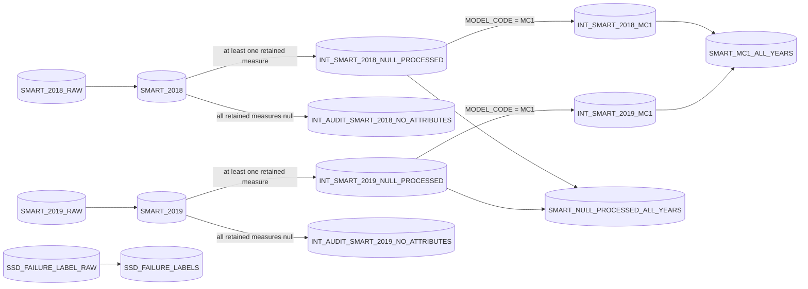

# Silver SMART processing

[Project home](../../../../../../README.md) · [dbt project](../../README.md) · **Silver** · [Gold](../gold/README.md) · [EDA evidence](../../../../python/spark/notebooks/ssd_null_analysis_book/README.md)

Silver converts Bronze `VARIANT` objects into typed, lineage-preserving records
and then applies the structural-missingness policy established by the EDA work.
It does not impute, replace, or remove partially missing SMART measurements.

## Processing topology



The clean and audit outputs form a lossless partition of each baseline SMART
model. dbt tests compare both directions with `MINUS`; a row must appear in
exactly the expected output content and no output may invent a source row.

## Relation inventory

| Relation | Grain | Columns | Materialization | Purpose |
| --- | --- | ---: | --- | --- |
| `SMART_2018` | One Bronze CSV row / 2018 daily SSD observation | 115 | Incremental merge | Type all 51 R/N attribute pairs and retain lineage |
| `SMART_2019` | One Bronze CSV row / 2019 daily SSD observation | 115 | Incremental merge | Same contract for 2019 |
| `SSD_FAILURE_LABELS` | One Bronze failure-label row | 14 | Incremental merge | Type SSD identity and failure timestamp/date |
| `INT_SMART_2018_NULL_PROCESSED` | One retained 2018 daily observation | 81 | Table | Remove 34 globally unavailable columns and exclude all-retained-null rows |
| `INT_SMART_2019_NULL_PROCESSED` | One retained 2019 daily observation | 81 | Table | Equivalent 2019 processing |
| `INT_AUDIT_SMART_2018_NO_ATTRIBUTES` | One quarantined 2018 observation | 83 | Table | Preserve no-retained-measurement rows with reason and source year |
| `INT_AUDIT_SMART_2019_NO_ATTRIBUTES` | One quarantined 2019 observation | 83 | Table | Equivalent 2019 quarantine |
| `INT_SMART_2018_MC1` | One retained 2018 MC1 daily observation | 57 | Table | Keep only MC1 and its 44 usable measures |
| `INT_SMART_2019_MC1` | One retained 2019 MC1 daily observation | 57 | Table | Equivalent 2019 specialization |
| `SMART_NULL_PROCESSED_ALL_YEARS` | One retained daily observation across both years and all models | 81 | Table | Exact `UNION ALL` of the two null-processed relations |
| `SMART_MC1_ALL_YEARS` | One retained MC1 daily observation across both years | 57 | Table | Exact `UNION ALL` of the two MC1 relations |

## Baseline SMART column dictionary

`SMART_2018` and `SMART_2019` have the same 115-column contract. Snowflake may
display unconstrained `VARCHAR` or `NUMBER` widths differently in metadata;
the types below describe the explicit model expressions and Bronze DDL.

| Column or column family | Type | Description |
| --- | --- | --- |
| `SILVER_RECORD_ID` | `VARCHAR` | SHA-256 of `SOURCE_ARCHIVE`, `SOURCE_FILE`, and `SOURCE_ROW`; unique incremental key |
| `SOURCE_FILE_ROW_HASH_KEY` | `VARCHAR` | SHA-256 of `SOURCE_FILE` and `SOURCE_SHA256`; content-analysis key, not assumed unique |
| `DISK_ID` | `NUMBER(38,0)` | Tolerantly parsed censored disk serial; combined with `MODEL_CODE` downstream |
| `OBSERVATION_DATE` | `DATE` | `RAW_RECORD:ds` parsed with `YYYYMMDD` |
| `MODEL_CODE` | `VARCHAR` | Trimmed censored SSD model identifier; empty strings become null |
| `N_1`, `R_1` | `NUMBER(38,6)` | Normalized and raw SMART attribute 1 |
| `N_2`, `R_2`; `N_3`, `R_3`; `N_4`, `R_4`; `N_5`, `R_5`; `N_6`, `R_6`; `N_7`, `R_7`; `N_8`, `R_8`; `N_9`, `R_9`; `N_10`, `R_10`; `N_11`, `R_11`; `N_12`, `R_12`; `N_13`, `R_13` | `NUMBER(38,6)` | Normalized/raw SMART pairs for low-numbered source attributes |
| `N_170`, `R_170`; `N_171`, `R_171`; `N_172`, `R_172`; `N_173`, `R_173`; `N_174`, `R_174`; `N_175`, `R_175`; `N_177`, `R_177`; `N_180`, `R_180`; `N_181`, `R_181`; `N_182`, `R_182`; `N_183`, `R_183`; `N_184`, `R_184` | `NUMBER(38,6)` | Normalized/raw SMART pairs for the listed attributes |
| `N_187`, `R_187`; `N_188`, `R_188`; `N_189`, `R_189`; `N_190`, `R_190`; `N_191`, `R_191`; `N_192`, `R_192`; `N_193`, `R_193`; `N_194`, `R_194`; `N_195`, `R_195`; `N_196`, `R_196`; `N_197`, `R_197`; `N_198`, `R_198`; `N_199`, `R_199`; `N_200`, `R_200` | `NUMBER(38,6)` | Normalized/raw SMART pairs for the listed attributes |
| `N_204`, `R_204`; `N_205`, `R_205`; `N_206`, `R_206`; `N_207`, `R_207`; `N_211`, `R_211`; `N_232`, `R_232`; `N_233`, `R_233`; `N_240`, `R_240`; `N_241`, `R_241`; `N_242`, `R_242`; `N_244`, `R_244`; `N_245`, `R_245` | `NUMBER(38,6)` | Normalized/raw SMART pairs for the listed attributes |
| `SOURCE_ARCHIVE` | `VARCHAR` | Landing ZIP archive name |
| `SOURCE_FILE` | `VARCHAR` | CSV member name within the archive |
| `SOURCE_ROW` | `NUMBER` | One-based source row number emitted by ingestion |
| `BRONZE_SOURCE_RELATION` | `VARCHAR` | Fully qualified dbt source relation captured as lineage |
| `SOURCE_DATE` | `DATE` | Date associated with the source file by Bronze ingestion |
| `SOURCE_SHA256` | `VARCHAR` | SHA-256 of the source-faithful JSON object |
| `BRONZE_INGESTED_AT` | `TIMESTAMP_LTZ` | Bronze insertion/update timestamp |
| `SILVER_LOADED_AT` | `TIMESTAMP_LTZ` | Timestamp when dbt evaluated the Silver row |

All 102 SMART columns use `TRY_TO_DECIMAL(..., 38, 6)`. Invalid numeric text
therefore becomes null rather than aborting the model. The source value remains
available in Bronze `RAW_RECORD` for investigation.

## Failure-label column dictionary

| Column | Type | Description |
| --- | --- | --- |
| `SILVER_RECORD_ID` | `VARCHAR` | SHA-256 lineage key derived from archive, file, and row |
| `SOURCE_FILE_ROW_HASH_KEY` | `VARCHAR` | File/content analysis hash |
| `DISK_ID` | `NUMBER(38,0)` | Parsed disk identifier |
| `MODEL_CODE` | `VARCHAR` | Trimmed SSD model code |
| `FAILURE_AT` | `TIMESTAMP_NTZ` | Parsed source failure timestamp without timezone conversion |
| `FAILURE_DATE` | `DATE` | Calendar date derived from `FAILURE_AT` |
| `SOURCE_ARCHIVE` | `VARCHAR` | Landing ZIP archive name |
| `SOURCE_FILE` | `VARCHAR` | CSV member name |
| `SOURCE_ROW` | `NUMBER` | Source row number |
| `BRONZE_SOURCE_RELATION` | `VARCHAR` | Fully qualified Bronze source relation |
| `SOURCE_DATE` | `DATE` | Bronze source date, when provided by ingestion |
| `SOURCE_SHA256` | `VARCHAR` | Source-record content hash |
| `BRONZE_INGESTED_AT` | `TIMESTAMP_LTZ` | Bronze ingestion timestamp |
| `SILVER_LOADED_AT` | `TIMESTAMP_LTZ` | Silver transformation timestamp |

## Processed SMART schemas

Every processed SMART relation retains the same 13 metadata/identity columns:

```text
SILVER_RECORD_ID, SOURCE_FILE_ROW_HASH_KEY, DISK_ID, OBSERVATION_DATE,
MODEL_CODE, SOURCE_ARCHIVE, SOURCE_FILE, SOURCE_ROW, BRONZE_SOURCE_RELATION,
SOURCE_DATE, SOURCE_SHA256, BRONZE_INGESTED_AT, SILVER_LOADED_AT
```

The all-model processed relations add these 68 `NUMBER(38,6)` measures:

```text
N_1/R_1, N_5/R_5, N_9/R_9, N_12/R_12,
N_170/R_170, N_171/R_171, N_172/R_172, N_173/R_173,
N_174/R_174, N_177/R_177, N_180/R_180, N_181/R_181,
N_182/R_182, N_183/R_183, N_184/R_184, N_187/R_187,
N_188/R_188, N_190/R_190, N_192/R_192, N_194/R_194,
N_195/R_195, N_196/R_196, N_197/R_197, N_198/R_198,
N_199/R_199, N_206/R_206, N_211/R_211, N_233/R_233,
N_241/R_241, N_242/R_242, N_244/R_244, N_245/R_245,
N_175/R_175, N_232/R_232
```

The MC1 relations retain this 44-measure subset:

```text
N_1/R_1, N_5/R_5, N_9/R_9, N_12/R_12,
N_170/R_170, N_171/R_171, N_172/R_172, N_173/R_173,
N_174/R_174, N_180/R_180, N_183/R_183, N_184/R_184,
N_187/R_187, N_188/R_188, N_194/R_194, N_195/R_195,
N_196/R_196, N_197/R_197, N_198/R_198, N_199/R_199,
N_206/R_206, N_211/R_211
```

Audit relations use the 81-column all-model processed schema and add:

| Column | Type | Description |
| --- | --- | --- |
| `SOURCE_YEAR` | `NUMBER(4,0)` | Constant `2018` or `2019` identifying the routed source model |
| `AUDIT_REASON` | `VARCHAR` | Constant `ALL_SMART_ATTRIBUTES_NULL` |

`SOURCE_YEAR` is audit context only. Final all-year tables omit it because the
year is derivable from `OBSERVATION_DATE`.

## Missingness policy and rationale

- Preserve partial nulls; do not replace them with zero, mean, median, or mode.
- Remove only the 17 attributes shown to be unavailable across both years from
  the all-model schema.
- Keep SMART 211 because it appears in 2019 even though it is absent in 2018.
- Quarantine rows where every retained R/N value is null rather than silently
  deleting their lineage.
- Remove 12 additional MC1-unavailable attributes only from the MC1 contract;
  they remain available for other models.
- Keep yearly processing separate until the schemas are identical, then use
  `UNION ALL` so no deduplication or aggregation is introduced.

The evidence and numerical findings are versioned in the
[null-structure analysis book](../../../../python/spark/notebooks/ssd_null_analysis_book/README.md).

## Keys, lineage, and incremental limitations

`SILVER_RECORD_ID` is stable while the source archive, member filename, and row
position remain stable. `SOURCE_FILE_ROW_HASH_KEY` supports content analysis but
is not unique: identical source objects can legitimately produce the same hash
within a file.

The baseline incremental predicate uses `INGESTED_AT > MAX(BRONZE_INGESTED_AT)`.
This is efficient for appended or re-ingested rows with a later timestamp, but
it is not a general change-data-capture stream. Run a deliberate full refresh
when historical Bronze contents or parsing logic must be reapplied globally.

## Silver validation

In addition to key and required-field tests, the implementation verifies:

- 2018 and 2019 observation dates are in the correct year and equal
  `SOURCE_DATE`;
- failure dates fall between 2018-01-01 and 2019-12-31;
- clean plus audit outputs reconcile exactly to their baseline source;
- no processed model physically contains forbidden SMART columns;
- every clean row has at least one retained measurement;
- every audit row has no retained measurement;
- final all-year tables exactly reconcile to their two yearly inputs; and
- every MC1 relation contains only `MODEL_CODE = 'MC1'`.

Build and test this layer with the commands in the
[dbt project README](../../README.md), then continue to the
[Gold dimensional model](../gold/README.md).
