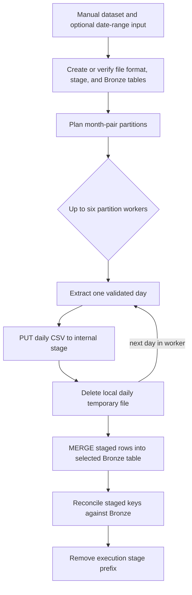

# Kestra Bronze ingestion

[Project home](../../../../README.md) · **Bronze ingestion** · [dbt transformations](../../dbt/ssd_failure_prediction/README.md)

This directory contains the source-controlled ingestion flow and its streaming
CSV preparation helper:

- [`bronze_ingestion.yml`](bronze_ingestion.yml) defines orchestration, Snowflake
  DDL, staging, merge, retries, validation, and worker concurrency.
- [`prepare_bronze.py`](prepare_bronze.py) validates ZIP members and source
  schemas, then emits bounded daily CSV files without materializing an entire
  year in local memory.

## Execution DAG

Each partition worker processes its assigned days sequentially, while up to six
independent month-pair partitions run concurrently. Table creation, upload,
merge, and reconciliation occur in Snowflake; ZIP validation and daily CSV
extraction occur in the Kestra container.

## Inputs and destinations

| Dataset input | Landing archive | Bronze table |
| --- | --- | --- |
| `smart_2018` | `smartlog2018ssd.zip` | `SMART_2018_RAW` |
| `smart_2019` | `smartlog2019ssd.zip` | `SMART_2019_RAW` |
| `failure_labels` | `ssd_failure_label.csv.zip` | `SSD_FAILURE_LABEL_RAW` |

Bronze preserves each CSV row as a source-faithful `VARIANT` object and adds
archive, member, row-number, date, SHA-256, and ingestion-time lineage.

All three Bronze tables share this physical schema:

| Column | Snowflake type | Description |
| --- | --- | --- |
| `SOURCE_ARCHIVE` | `VARCHAR` | Landing ZIP filename |
| `SOURCE_FILE` | `VARCHAR` | CSV member path inside the archive |
| `SOURCE_ROW` | `NUMBER` | Source row number used in the merge key |
| `SOURCE_DATE` | `DATE` | Date inferred for a daily SMART member; may be null for labels |
| `SOURCE_SHA256` | `VARCHAR` | SHA-256 of the source-faithful JSON object |
| `RAW_RECORD` | `VARIANT` | Original CSV field names and text values represented as an object |
| `INGESTED_AT` | `TIMESTAMP_LTZ` | Insert/update timestamp, defaulting to the current time |

The two SMART inputs have 105 CSV columns: `disk_id`, `ds`, `model`, and 51
normalized/raw SMART pairs. The label input has `model`, `failure_time`, and
`disk_id`. `prepare_bronze.py` rejects unexpected member schemas, row widths,
encodings, dates, and hidden archive metadata before upload.

## Trigger, retries, and historical backfill

[`bronze_daily_schedule.yml`](bronze_daily_schedule.yml) has a daily `Schedule`
trigger (03:00) that loads the previous day through `bronze_ingestion` as a
subflow. Kestra's native trigger backfill (Triggers → Backfill executions, from
2018-01-02 to 2020-01-01) replays the whole historical range one day per
execution. Ticks outside the 2018–2019 source coverage log "no data" and succeed.
Archive download stays manual because the authenticated Alibaba/Tianchi source
exposes no API; once an archive is in the read-only landing directory, ingestion
is automated. [`ssd_pipeline.yml`](ssd_pipeline.yml) orchestrates ingestion →
`dbt build` → MC1 OBT (weekly schedule or manual) and runs dbt and Spark inside
their own containers through [`docker_exec.py`](docker_exec.py).

Deterministic errors—missing ZIPs, unexpected schemas, malformed rows, invalid
UTF-8, or invalid date ranges—fail immediately. Transient Snowflake DDL, upload,
and merge failures use bounded retries. Final reconciliation fails the execution
if staged rows are absent from Bronze.

SMART backfills use inclusive `requested_start_date` and
`requested_end_date` values in `YYYY-MM-DD` format. Replaying a day or range is
safe because the merge key `(SOURCE_ARCHIVE, SOURCE_FILE, SOURCE_ROW)` inserts
new rows, leaves identical rows unchanged, and updates content only when the
source hash changes.

## Execution

Flows are imported automatically by the one-shot `kestra-flow-sync` Compose
service. After editing a YAML file, rerun it with
`docker compose --env-file src/res/env/.env up kestra-flow-sync`. Python helpers
are read from the bind mount on every execution. Successful executions remove
their files from the Snowflake stage; a `finally` block always deletes local
temporary CSV files.

For environment setup, ports, secrets, and Snowflake bootstrap requirements,
return to the [project README](../../../../README.md). After Bronze is populated,
continue with the [dbt project](../../dbt/ssd_failure_prediction/README.md).
