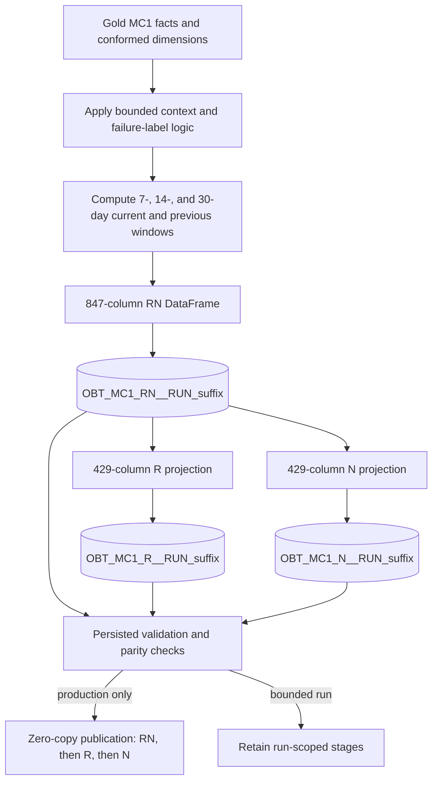

# Spark and Snowpark Connect jobs

[Project home](../../../../../README.md) · [Gold inputs](../../../dbt/ssd_failure_prediction/models/gold/README.md) · **MC1 OBT jobs** · [Notebooks and EDA](../notebooks/README.md) · [Runtime images](../../../../res/docker/custom-images/README.md)

## Canonical MC1 OBT builder

[`build_mc1_obt.py`](build_mc1_obt.py) is the version-controlled executable for
the final MC1 analytical datasets. It uses the PySpark DataFrame API through
Snowpark Connect, so the Gold scans, joins, calendar windows, validation
aggregates, and table writes are evaluated by the configured Snowflake
warehouse rather than loaded into local container memory.

The job reads only these Gold relations:

```text
<SNOWFLAKE_DATABASE>.<SNOWFLAKE_GOLD_SCHEMA>.DIM_SSD
<SNOWFLAKE_DATABASE>.<SNOWFLAKE_GOLD_SCHEMA>.DIM_DATE
<SNOWFLAKE_DATABASE>.<SNOWFLAKE_GOLD_SCHEMA>.FCT_SMART_DAILY_MC1
<SNOWFLAKE_DATABASE>.<SNOWFLAKE_GOLD_SCHEMA>.FCT_FAILURE_EVENT_MC1
```

It produces these canonical OBT relations:

```text
<SNOWFLAKE_DATABASE>.<SNOWFLAKE_OBT_SCHEMA>.OBT_MC1_RN
<SNOWFLAKE_DATABASE>.<SNOWFLAKE_OBT_SCHEMA>.OBT_MC1_R
<SNOWFLAKE_DATABASE>.<SNOWFLAKE_OBT_SCHEMA>.OBT_MC1_N
<SNOWFLAKE_DATABASE>.<SNOWFLAKE_OBT_SCHEMA>.OBT_MC1_RUN_AUDIT
```

`SNOWFLAKE_GOLD_SCHEMA` defaults to `S_CDATOS_PSET2_GOLD` and
`SNOWFLAKE_OBT_SCHEMA` defaults to `S_CDATOS_PSET2_OBT`. The database remains a
required caller-supplied value. Compose maps the dedicated
`SNOWFLAKE_WAREHOUSE_HIGH_COMPUTE` host variable to `SNOWFLAKE_WAREHOUSE`
inside the `snowpark-connect` container.

### Processing and publication contract

The program computes the complete 847-column RN frame once. It persists and
validates that run-scoped RN table before projecting the 429-column R and N
variants. R and N never recalculate rolling windows.



Production publication uses three Snowflake `CREATE OR REPLACE TABLE ...
CLONE ... COPY GRANTS` statements. They are metadata operations, not feature
SQL. The three replacements are deliberately documented as non-atomic. If any
publication step fails, the run-scoped tables remain available for diagnosis
and recovery.

### Run commands

Build the pinned runtime first:

```bash
docker compose --env-file src/res/env/.env build snowpark-connect
```

Perform a bounded contract validation without creating OBT stages or an audit
row:

```bash
docker compose --env-file src/res/env/.env run --rm --no-deps \
  snowpark-connect \
  python /opt/spark/jobs/build_mc1_obt.py \
  --start-date 2018-01-01 \
  --end-date 2018-01-31 \
  --ssd-limit 100 \
  --validate-only
```

Materialize a bounded development run by omitting `--validate-only`. It writes
and validates run-scoped staging tables, records the attempt in the audit
table, retains the stages, and does **not** replace canonical OBT tables:

```bash
docker compose --env-file src/res/env/.env run --rm --no-deps \
  snowpark-connect \
  python /opt/spark/jobs/build_mc1_obt.py \
  --start-date 2018-01-01 \
  --end-date 2018-01-31 \
  --ssd-limit 100
```

Run the complete production build with no date or SSD restriction:

```bash
docker compose --env-file src/res/env/.env run --rm --no-deps \
  snowpark-connect \
  python /opt/spark/jobs/build_mc1_obt.py
```

Optional flags:

- `--explain-plan` prints the generated RN execution plan before writing.
- `--keep-staging` retains validated production stages after publication.
- `--start-date` and `--end-date` use inclusive `YYYY-MM-DD` values.
- `--ssd-limit` selects one deterministic SSD population ordered by `SSD_KEY`.

Any bounded run is non-production and cannot publish canonical tables. Feature
context begins up to 59 days before the requested start and extends up to 30
days after the requested end before rows are filtered back to the requested
output interval.

Exit codes are:

```text
0  success
2  blocking validation failure
3  execution, Snowflake, write, or publication failure
```

The Snowflake role must be able to use the configured warehouse, read the four
Gold relations, use the project database, and create/replace tables in the OBT
schema. If the OBT schema does not already exist, the role also needs permission
to create it.

### Local contract tests

The small local test fixture does not connect to Snowflake and does not test
production scale. It validates the generated schemas, window semantics, labels,
blocking predicates, and R/N projection parity:

```bash
docker compose --env-file src/res/env/.env run --rm --no-deps \
  -v .:/workspace:ro \
  snowpark-connect \
  python /workspace/src/test/python/spark/test_build_mc1_obt_contract.py
```

## Legacy connectivity helpers

`build_obt.py` and `check_snowflake_connection.py` belong to the earlier classic
Spark connector runtime. They are not used by the MC1 Snowpark Connect build.

Return to the [project README](../../../../../README.md) for the complete
Bronze-to-OBT lineage and documentation map.
