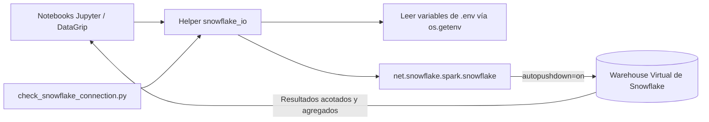

# Librería compartida de Spark (`snowflake_io`)

[Inicio del proyecto](../../../../../README.md) · [Plataforma Spark](../README.md) · **Librería Spark** · [Jobs](../jobs/README.md) · [Notebooks](../notebooks/README.md)

Este directorio contiene las funciones auxiliares compartidas utilizadas por los notebooks de análisis exploratorio (EDA) y los scripts de verificación de conectividad que se ejecutan dentro del contenedor `spark`.

---

## Visión general del módulo

[`snowflake_io.py`](snowflake_io.py) proporciona una abstracción centralizada, segura y reutilizable sobre el conector oficial `net.snowflake.spark.snowflake` y el controlador JDBC de Snowflake.



### Distinción arquitectónica fundamental

- **Utilizado por:** Los notebooks interactivos de EDA ([`notebooks/datagrip/`](../notebooks/README.md)) y los scripts de diagnóstico ([`check_snowflake_connection.py`](../jobs/check_snowflake_connection.py)).
- **NO utilizado por:** El generador oficial de la OBT MC1 ([`jobs/build_mc1_obt.py`](../jobs/README.md)). El generador de la OBT emplea **Snowpark Connect para Spark** (`snowflake.snowpark_connect`), el cual compila el plan de ejecución de DataFrames de PySpark y lo evalúa de forma nativa dentro del warehouse de cómputo pesado de Snowflake, sin transferir datos masivos a la memoria local.

---

## Referencia de funciones

### 1. `create_spark_session(app_name="ssd-failure-notebook") -> SparkSession`

Crea u obtiene la sesión de Spark local configurada para el entorno del contenedor.

- **Master:** Configurado en `spark-defaults.conf` como `local[*]`.
- **Zona horaria:** Fija la zona horaria de la sesión a `UTC` (`spark.sql.session.timeZone = "UTC"`), garantizando un cálculo consistente y determinista de fechas sin importar la configuración regional de la máquina anfitriona.

### 2. `snowflake_options(schema=None) -> dict[str, str]`

Construye el diccionario de opciones de conexión requerido por el conector clásico de Spark sin registrar ni persistir credenciales en texto claro.

Parámetros clave configurados:
- `sfURL`: Derivado de `SNOWFLAKE_ACCOUNT` (normaliza el identificador agregando `.snowflakecomputing.com` si es necesario).
- `sfUser`, `sfPassword`: Inyectados de forma segura desde las variables de entorno del contenedor.
- `sfWarehouse`, `sfDatabase`: Contexto de cómputo y base de datos de Snowflake.
- `sfSchema`: Esquema destino, usando por defecto `SNOWFLAKE_SCHEMA` si no se especifica explícitamente.
- `autopushdown`: Configurado fijamente en `"on"`. Indica a Spark que traslade las operaciones de filtrado, proyección, ordenamiento y agregación directamente al motor de Snowflake.
- `sfTimezone`: Configurado en `"spark"` para garantizar la interpretación correcta de marcas de tiempo.
- `sfRole`: Rol opcional de Snowflake, incluido si la variable `SNOWFLAKE_ROLE` está presente.

### 3. `read_snowflake_table(spark, table, *, schema=None, extra_options=None) -> DataFrame`

Devuelve un **DataFrame perezoso (*lazy*) de PySpark** respaldado por una tabla de Snowflake:

```python
from snowflake_io import create_spark_session, read_snowflake_table

spark = create_spark_session("sesion-eda")
df = read_snowflake_table(spark, "SMART_2018", schema="S_CDATOS_PSET2_SILVER")
```

Al ser perezoso, no se transfiere ningún dato por la red hasta que se invoque una acción explícita (como `.count()` o `.show()`). Al aplicar filtros o agregaciones sobre `df`, el conector los traduce a SQL en Snowflake.

### 4. `read_snowflake_query(spark, query, *, schema=None, extra_options=None) -> DataFrame`

Ejecuta una consulta SQL explícita en Snowflake y expone el resultado como un DataFrame de PySpark:

```python
from snowflake_io import create_spark_session, read_snowflake_query

spark = create_spark_session("consulta-eda")
resumen_df = read_snowflake_query(
    spark,
    """
    SELECT MODEL_CODE, COUNT(*) AS TOTAL_OBSERVACIONES
    FROM S_CDATOS_PSET2.S_CDATOS_PSET2_SILVER.SMART_2018
    GROUP BY MODEL_CODE
    ORDER BY TOTAL_OBSERVACIONES DESC
    """,
)
```

Esta función es el mecanismo principal de los notebooks de EDA: Snowflake procesa y agrega cientos de millones de filas crudas y devuelve únicamente resultados resumidos (decenas o miles de filas) que caben holgadamente en la memoria del contenedor local.

---

## Consideraciones de seguridad

- **Sin almacenamiento en caché de secretos:** Los diccionarios de opciones se generan en memoria durante la ejecución y jamás se escriben en disco ni se imprimen en consola.
- **Validación estricta y temprana:** Si falta alguna variable obligatoria (`SNOWFLAKE_ACCOUNT`, `SNOWFLAKE_USER`, `SNOWFLAKE_PASSWORD`, `SNOWFLAKE_WAREHOUSE`, `SNOWFLAKE_DATABASE`, `SNOWFLAKE_SCHEMA`), se genera de inmediato una excepción descriptiva `RuntimeError` en lugar de fallar silenciosamente.
