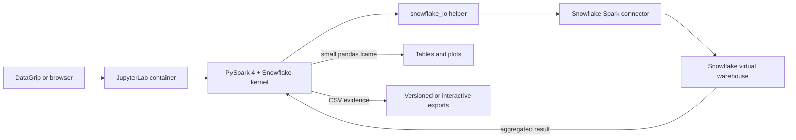

# Spark notebooks

[Project home](../../../../../README.md) · [Silver models](../../../dbt/ssd_failure_prediction/models/silver/README.md) · **Notebooks and EDA** · [Null-analysis book](ssd_null_analysis_book/README.md) · [MC1 OBT jobs](../jobs/README.md)

JupyterLab serves this directory at `http://127.0.0.1:${JUPYTER_PORT}`. Use the
token stored in the private `src/res/env/.env` file. The Spark application UI is
available at `http://127.0.0.1:${SPARK_UI_PORT}` while a notebook Spark session
is active.

When connecting from DataGrip, configure the remote Jupyter server with the
host URL and token from `JUPYTER_PORT` and `JUPYTER_TOKEN`. Select the
`PySpark 4 + Snowflake` kernel for this project. Do not select a local Python
interpreter or the generic `Python 3 (ipykernel)` kernel: those environments do
not receive Spark's Python, Py4J, connector JAR, or `/opt/spark/lib` paths.

The custom kernel is defined in
`src/res/config/spark/kernels/pyspark-snowflake/kernel.json`. A quick kernel
check is:

```python
import os
import sys

import pyspark
import snowflake_io

print(sys.executable)          # /usr/bin/python3
print(pyspark.__version__)     # 4.0.4
print(os.environ["SPARK_HOME"])  # /opt/spark
```

Notebook code can then import the shared connector helpers directly:

```python
from snowflake_io import create_spark_session, read_snowflake_table

spark = create_spark_session("smart-quality-analysis")
smart_2018 = read_snowflake_table(
    spark,
    "SMART_2018",
    schema="S_CDATOS_PSET2_SILVER",
)
```

The Snowflake connector uses the configured virtual warehouse and enables
query pushdown. Operations that cannot be pushed down still execute with the
container's `local[*]` Spark master. Never call `toPandas()` on a complete SMART
table; aggregate or sample in Spark first.



Filtering, projection, and aggregation should remain in the connector path so
Snowflake performs the large scan. Only bounded aggregate results belong in
pandas or plotting libraries inside the local container.

The SMART 2018 and 2019 notebooks are generated from
`build_eda_smart2018_notebook.py`. Despite its historical filename, the
generator accepts either supported year and creates numbered menus for selecting
one univariate variable or two interaction variables. Regenerate them from the
project root with:

```bash
python3 src/main/python/spark/notebooks/build_eda_smart2018_notebook.py --year 2018
python3 src/main/python/spark/notebooks/build_eda_smart2018_notebook.py --year 2019
```

The labels notebook is purpose-built for its event grain and is generated with:

```bash
python3 src/main/python/spark/notebooks/build_eda_failure_labels_notebook.py
```

## Packaged null-structure analysis

[`ssd_null_analysis_book/`](ssd_null_analysis_book/) is the versioned,
self-contained analysis package used to document the SMART missingness findings
that informed the Silver and MC1 modeling policies. It contains:

- five small pandas-based notebooks under `notebooks/`;
- seven interpretation and methodology chapters under `docs/`;
- the exact CSV evidence consumed by those notebooks under `exports/`;
- an export manifest with file sizes and SHA-256 hashes; and
- a minimal standalone `requirements.txt`.

These packaged notebooks analyze already aggregated CSV evidence and therefore
use a normal Python kernel. The DataGrip notebooks under `datagrip/` are the
ones that connect to Snowflake through the project Spark kernel.

Directories named `*-pycharm-support-libs/` are IDE-downloaded debugger and
table-rendering runtimes. They are intentionally ignored because they are not
authored notebook source and PyCharm recreates them when required.

Menu item `1` maps to `R_1`. Pairwise covariance/correlation is exact by
default, while its relationship graph uses a bounded Snowflake sample. Null
ranking, null-pattern, and disk/model summaries remain exact warehouse
aggregations. The two null tables export independently to
`src/main/python/spark/notebooks/exports` on the host.

A Spanish walkthrough of both notebook families (every EDA section with its
Snowflake query and finding, and every null-analysis notebook with its result)
is in [`docs/10_notebooks.md`](../../../../../docs/10_notebooks.md).

For the conclusions derived from those exports, continue with the
[SSD SMART null-structure analysis book](ssd_null_analysis_book/README.md).
