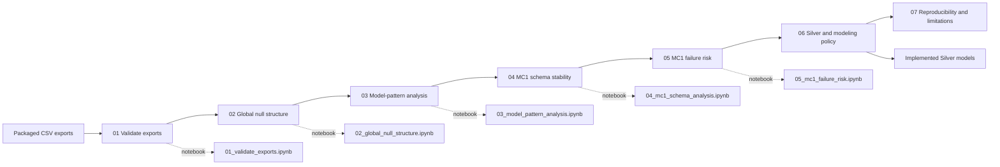

# SSD SMART Null-Structure Analysis Book

[Project home](../../../../../../README.md) · [Notebook hub](../README.md) · **Null-analysis book** · [Export manifest](exports/README.md) · [Silver policy](../../../../dbt/ssd_failure_prediction/models/silver/README.md)

This package documents and reproduces the reasoning used to decide how missing SMART telemetry should be handled before modeling the MC1 SSD failure predictor.

The material is deliberately split into short chapters and matching Jupyter notebooks rather than one long report. The notebooks load their inputs from `../exports` relative to the `notebooks/` directory, exactly as requested.

## Evidence and reading flow

Chapters explain the evidence and its implications; notebooks perform the
corresponding calculations against the immutable files listed in the
[export manifest](exports/README.md).

## Main conclusions

1. The SMART data does **not** behave like an ordinary table with independent random missing cells. Missingness is highly structured and `R_x`/`N_x` representations disappear together in every observed global null pattern in both years.
2. Seventeen SMART attributes (2, 3, 4, 6, 7, 8, 10, 11, 13, 189, 191, 193, 200, 204, 205, 207, 240) are 100% absent in both 2018 and 2019. Their 34 columns can be removed from the shared modeling lineage because no observed value exists in either year.
3. SMART 211 is 100% absent in 2018 but appears in 2019, so it should remain in the shared cross-year schema. For MC1 in 2019 it is still extremely sparse: 2,738 non-null observations out of 61,484,596 rows.
4. All-SMART-null rows are quarantined rather than used for training: 490,285 rows in 2018 and 635 in 2019.
5. MC1 has twelve additional attributes (175, 177, 181, 182, 190, 192, 232, 233, 241, 242, 244, 245) that are structurally unavailable for MC1 in both years. They should remain in a generic multi-model Silver table but be removed when the MC1-specific feature schema is created.
6. The dominant MC1 null pattern is the same in both years and covers 99.760818% of MC1 rows in 2018 and 99.974704% in 2019.
7. That dominant pattern does not provide meaningful failure-risk lift over the annual MC1 baseline: 0.105243% vs 0.105071% in 2018, and 0.404120% vs 0.404121% in 2019.
8. Therefore partially missing SMART values should be preserved as missing values for downstream models that can handle them natively; they should not be globally mean/median/mode/zero imputed.

## Reading order

- [01 — Data inventory and validation](docs/01_data_inventory_and_validation.md)
- [02 — Global null structure across 2018 and 2019](docs/02_global_null_structure.md)
- [03 — Model-specific missingness](docs/03_model_specific_missingness.md)
- [04 — MC1 schema and cross-year stability](docs/04_mc1_schema_and_cross_year_stability.md)
- [05 — Failure-risk interpretation](docs/05_failure_risk_interpretation.md)
- [06 — Silver-layer and modeling policy](docs/06_silver_layer_and_modeling_policy.md)
- [07 — Reproducibility, limitations, and next analyses](docs/07_reproducibility_and_limitations.md)

## Notebooks

- [`01_validate_exports.ipynb`](notebooks/01_validate_exports.ipynb)
- [`02_global_null_structure.ipynb`](notebooks/02_global_null_structure.ipynb)
- [`03_model_pattern_analysis.ipynb`](notebooks/03_model_pattern_analysis.ipynb)
- [`04_mc1_schema_analysis.ipynb`](notebooks/04_mc1_schema_analysis.ipynb)
- [`05_mc1_failure_risk.ipynb`](notebooks/05_mc1_failure_risk.ipynb)

All notebooks were executed successfully against the CSVs included in `exports/` before packaging.

The resulting decisions are implemented in the
[Silver SMART models](../../../../dbt/ssd_failure_prediction/models/silver/README.md).
