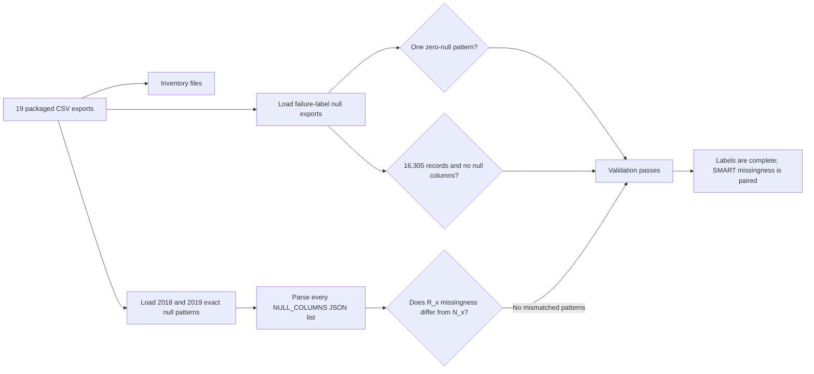

# 01. Data inventory and validation

[Analysis book](../README.md) · **01 Data inventory** · [Next: global null structure](02_global_null_structure.md) · [Notebook](../notebooks/01_validate_exports.ipynb) · [Exports](../exports/README.md)

## Purpose

Before drawing conclusions from missingness, the exported summaries must be checked for internal consistency. This chapter establishes what the files contain and which statements can be reproduced directly from them.

## Notebook evidence flow

This is the assertion sequence implemented in
[`01_validate_exports.ipynb`](../notebooks/01_validate_exports.ipynb).

## Data represented by the exports

The global SMART summaries contain 135,843,663 2018 rows and 137,268,621 2019 rows. The failure-label null audit contains 16,305 records and reports zero missing columns in every record. Therefore the missing-value problem addressed in this book belongs to the SMART telemetry, not to the failure-label table.

The analysis uses 102 SMART columns, corresponding to 51 `R_x` / `N_x` pairs. `R_x` is treated as the raw representation and `N_x` as the normalized representation only at the level of naming used in the dataset. The supplied summary exports are sufficient to analyze missingness, but **not** to reconstruct the numerical transformation between `R_x` and `N_x`.

## Pairwise missingness validation

A critical structural test is whether one member of an `R_x` / `N_x` pair can be absent while the other is present. The global null-pattern exports contain zero observed patterns with such a mismatch in either year. In every observed pattern, an attribute is either represented by both columns or both columns are missing.

This does not prove why the pair is missing. It does show that treating 102 columns as 102 independent missingness mechanisms would misrepresent the observed data. At the missingness level, the data behaves more like 51 paired SMART attributes.

## Failure-label completeness

`ssd_failure_labels_null_combinations.csv` contains one row: zero null columns across all 16,305 failure-label records. `ssd_failure_labels_null_counts_by_column.csv` is empty because no failure-label column has a positive null count.

### Conclusion

No label-side imputation policy is required based on these exports. The null-processing strategy should be designed around the SMART telemetry while keeping label construction and censoring rules as separate concerns.

## Reproduction

Run [`01_validate_exports.ipynb`](../notebooks/01_validate_exports.ipynb), then
continue to [global null structure](02_global_null_structure.md).
