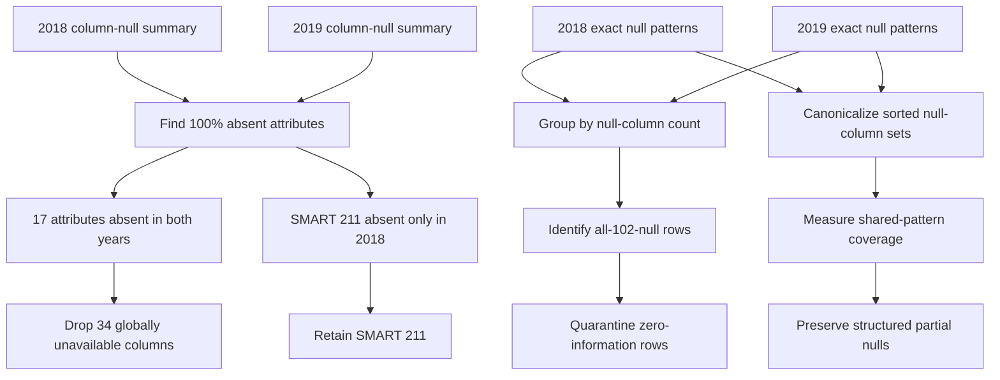

# 02. Global null structure across 2018 and 2019

[Analysis book](../README.md) · [Previous: data validation](01_data_inventory_and_validation.md) · **02 Global structure** · [Next: model patterns](03_model_specific_missingness.md) · [Notebook](../notebooks/02_global_null_structure.ipynb)

## Notebook analysis flow

## Why the missingness cannot be treated as ordinary random gaps

The global summaries show thousands of exact null combinations—4,705 in 2018 and 3,379 in 2019—but most rows belong to a very small family of high-frequency structures. Rows with exactly 60, 62, 64, or 66 null SMART columns account for 97.244246% of 2018 and 98.135546% of 2019.

Because `R_x` and `N_x` always disappear together in the observed pattern exports, these even null counts correspond naturally to absent SMART attributes rather than arbitrary isolated cells.

## Cross-year structural overlap

After canonicalizing each null combination so that column order does not matter, 1,227 exact null sets occur in both years. Those shared sets account for 99.995174% of all 2018 rows and 99.812609% of all 2019 rows.

This is important because textual ordering differences in a serialized list must not be mistaken for different missingness structures. The notebook therefore parses each JSON list and compares sorted sets.

## Universally unavailable attributes

2018 contains 18 completely absent SMART attributes; 2019 contains 17. Their intersection contains 17 attributes:

`2, 3, 4, 6, 7, 8, 10, 11, 13, 189, 191, 193, 200, 204, 205, 207, 240`

These correspond to 34 `R_x` / `N_x` columns with no observed value in either year. There is no empirical basis for imputing them. They provide no numerical variation to a cross-year model and can be removed from the shared modeling schema while remaining preserved in Bronze/raw storage if desired.

SMART 211 is the only 2018-only completely absent attribute. Because it appears in 2019, it should **not** be discarded from a unified 2018–2019 Silver schema merely because 2018 cannot populate it.

## All-SMART-null rows

The all-102-null pattern contains 490,285 rows in 2018 (0.360919%) and 635 rows in 2019 (0.000463%). These rows contain no SMART measurement from which a value-based predictor can learn.

The recommended treatment is quarantine, not destructive deletion: move them out of the main modeling lineage into year-specific audit tables. Their presence can later be investigated as a possible collection or ingestion phenomenon without allowing zero-information records to dominate feature engineering.

## What is *not* concluded

The summaries do not prove that missingness is caused by SSD model, firmware, or health. They only prove that it is highly structured. Model-level exports are required for the next step.

## Reproduction

Run [`02_global_null_structure.ipynb`](../notebooks/02_global_null_structure.ipynb),
then continue to [model-specific missingness](03_model_specific_missingness.md).
