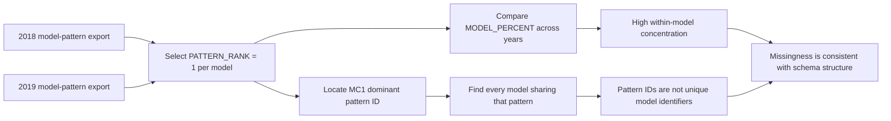

# 03. Model-specific missingness

[Analysis book](../README.md) · [Previous: global structure](02_global_null_structure.md) · **03 Model patterns** · [Next: MC1 stability](04_mc1_schema_and_cross_year_stability.md) · [Notebook](../notebooks/03_model_pattern_analysis.ipynb)

## Question

Are the dominant null combinations largely signatures of SSD model/schema, or are they primarily irregular telemetry failures?

## Notebook analysis flow

The `smart_2018_model_null_patterns.csv` and `smart_2019_model_null_patterns.csv` exports summarize the ten leading patterns for each of the six model codes (`MA1`, `MA2`, `MB1`, `MB2`, `MC1`, `MC2`).

## Observed concentration by model

For most model codes, one pattern dominates almost the entire model population. In 2018 the leading pattern covers approximately 99.40% of MA2, 99.72% of MB1, 99.69% of MB2, 99.76% of MC1, and 99.97% of MC2. MA1 is less concentrated at roughly 72.83%. The 2019 results are similarly concentrated for MA2, MB1, MB2, and MC1, while MC2 is somewhat less concentrated than in 2018.

This supports—but does not by itself prove—the interpretation that missingness is strongly related to device/schema population rather than independent random corruption.

## Important nuance: patterns can be shared by models

A null pattern is not necessarily a unique model identifier. In the provided summaries the dominant MC1 pattern is also present in MC2, and the share of that pattern contributed by each model changes between years. Therefore the analysis should not convert a pattern into a categorical proxy for `MODEL` and assume a one-to-one mapping.

## Modeling implication

For a project scoped to MC1, the role of the all-model analysis is diagnostic. It justifies studying missingness as structural and motivates building an MC1-specific feature schema. It does **not** require developing predictive models for all six SSD families.

## Reproduction

Run [`03_model_pattern_analysis.ipynb`](../notebooks/03_model_pattern_analysis.ipynb),
then continue to [MC1 schema stability](04_mc1_schema_and_cross_year_stability.md).
