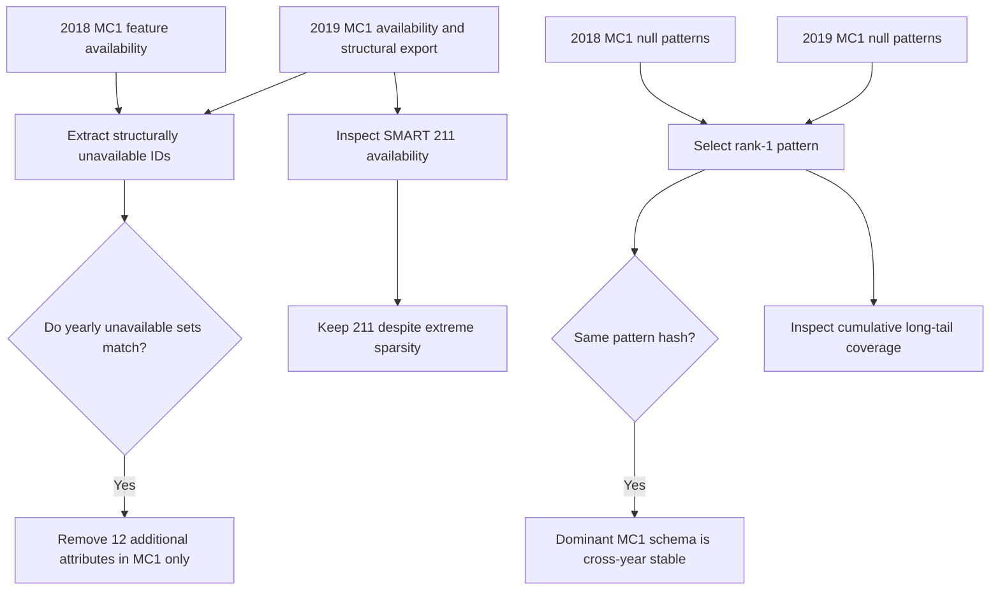

# 04. MC1 schema and cross-year stability

[Analysis book](../README.md) · [Previous: model patterns](03_model_specific_missingness.md) · **04 MC1 stability** · [Next: failure risk](05_failure_risk_interpretation.md) · [Notebook](../notebooks/04_mc1_schema_analysis.ipynb)

## Notebook comparison flow

## Why MC1 needs its own schema

A feature can exist somewhere in the global dataset yet be permanently absent from MC1. Since the project predictor is scoped to MC1, such a feature still has zero training information for the target population.

The 2018 and 2019 MC1 structural-unavailability exports agree on twelve additional SMART attributes:

`175, 177, 181, 182, 190, 192, 232, 233, 241, 242, 244, 245`

These are not part of the 17 globally absent attributes. They should therefore remain available in a generic multi-model Silver table, but they can be removed from the MC1-specific feature table because MC1 never reports them in either year.

## SMART 211

SMART 211 demonstrates why cross-year decisions must be made carefully. It is completely absent globally in 2018, but present in 2019. Within MC1 during 2019, `R_211` and `N_211` each contain 2,738 observed values and 61,481,858 nulls, or 99.995547% null.

That extreme sparsity may later make 211 useless to the classifier, but the Silver cleaning stage should not decide that on absence alone. It is retained until feature selection/model evaluation can test whether it contributes information.

## Dominant MC1 null pattern

The same pattern ID—`d237e8c2e2409dd8e304d0e30a9928d96ed499ac595f6e4c132ff2232474423e`—is rank 1 in both years. It covers:

- 2018: 53,660,875 of 53,789,530 MC1 rows (99.760818%).
- 2019: 61,469,043 of 61,484,596 MC1 rows (99.974704%).

Therefore the first impression that MC1's basic missingness schema changed radically between 2018 and 2019 is not supported by these exports. The long tail of rare patterns changes, but the overwhelming majority of MC1 rows share the same cross-year pattern.

## Rare-pattern caution

The remaining MC1 patterns individually represent tiny fractions of the population. Their apparent associations with failure can therefore be statistically unstable. A handful of positive labels can move a rare pattern's observed failure percentage substantially.

## Reproduction

Run [`04_mc1_schema_analysis.ipynb`](../notebooks/04_mc1_schema_analysis.ipynb),
then continue to [failure-risk interpretation](05_failure_risk_interpretation.md).
