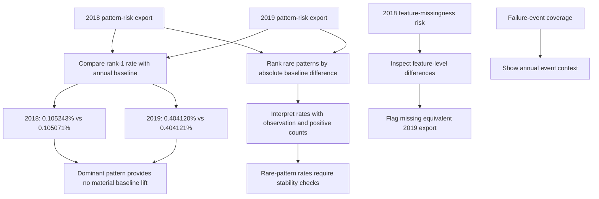

# 05. Failure-risk interpretation

[Analysis book](../README.md) · [Previous: MC1 stability](04_mc1_schema_and_cross_year_stability.md) · **05 Failure risk** · [Next: Silver policy](06_silver_layer_and_modeling_policy.md) · [Notebook](../notebooks/05_mc1_failure_risk.ipynb)

## Notebook evidence flow

## The central cross-year result

MC1's overall eligible-row failure rate changes materially between the two years:

- 2018 baseline: 0.105071%
- 2019 baseline: 0.404121%

The dominant MC1 null pattern changes almost exactly with that baseline:

- 2018 dominant-pattern failure rate: 0.105243% (difference from baseline +0.000172 percentage points)
- 2019 dominant-pattern failure rate: 0.404120% (difference from baseline -0.000001 percentage points)

Because the dominant pattern represents essentially the normal MC1 schema in both years, the rise in its failure rate should not be interpreted as the pattern becoming an early-warning signal. The entire MC1 target base rate shifted.

Formally, the observed evidence is consistent with:

`P(failure | dominant pattern, year) ≈ P(failure | MC1, year)`

rather than a stable pattern-specific excess risk.

## Why the temporal split matters

A random train/test split across both years could mix the lower-prevalence and higher-prevalence periods. The project's month-based temporal training/validation strategy is therefore useful: it tests whether value-based SMART signals learned in earlier periods continue to discriminate failures when the target prevalence changes.

## Rare pattern rates

Some rare patterns show failure percentages visibly above or below the annual MC1 baseline. Those observations are worth retaining as exploratory evidence, but they should not be promoted to rules without sample-size and stability checks. Many rare patterns contain only hundreds of observations and a very small number of positives.

## Feature-level missingness risk

The uploaded exports include `smart_2018_mc1_feature_missingness_risk.csv`, allowing feature-by-feature 2018 comparison of failure rates when each feature is null versus present. The corresponding 2019 feature-level export was not supplied. Consequently this package does **not** claim a reproduced cross-year feature-level comparison. The notebook reports 2018 results and explicitly flags the missing 2019 source.

## Failure-event coverage

The supplied failure-coverage export reports 1,964 failure events in 2018 and 8,546 in 2019 across the failure dataset. This is contextual evidence of a large year difference in recorded failures, but it should not be substituted for the MC1 eligible-row target rates above because the populations and denominators differ.

## Conclusion

The null-pattern investigation does not provide evidence that the dominant MC1 missingness pattern is a useful early-warning feature. Its main value is schema characterization. Predictive effort should therefore move toward the values and temporal evolution of SMART attributes that MC1 actually reports.

## Reproduction

Run [`05_mc1_failure_risk.ipynb`](../notebooks/05_mc1_failure_risk.ipynb), then
continue to the [Silver and modeling policy](06_silver_layer_and_modeling_policy.md).
