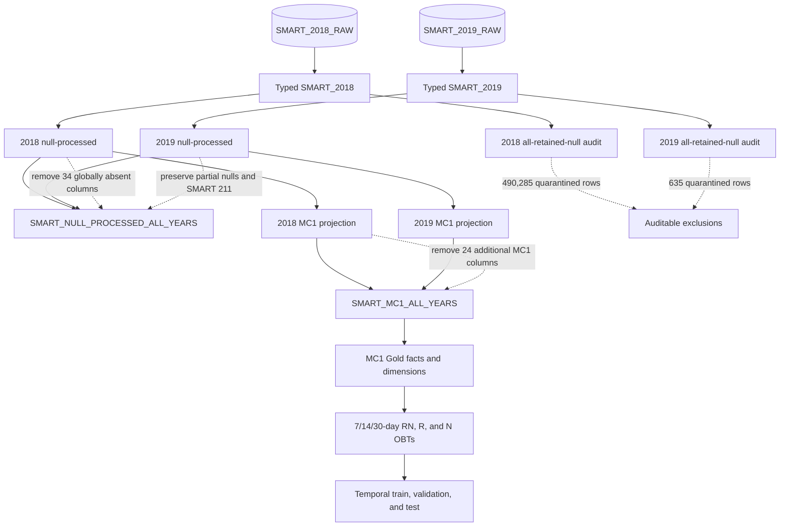

# 06. Silver-layer and modeling policy

[Analysis book](../README.md) · [Previous: failure risk](05_failure_risk_interpretation.md) · **06 Silver policy** · [Next: reproducibility](07_reproducibility_and_limitations.md) · [Implemented Silver models](../../../../../dbt/ssd_failure_prediction/models/silver/README.md)

## Objective

The ETL/ELT design should preserve information, avoid inventing SMART measurements, and make every exclusion auditable.

## Recommended lineage

## Why globally partial features are retained

A percentage threshold such as “drop features with >50% missing values” is not supported by the observed structure. A high null rate may reflect that a feature is valid only for certain device populations or periods. Removing such columns globally would destroy observed information before the MC1-specific schema is known.

## Why partial values are not imputed globally

Mean, median, mode, zero, or nearest-neighbor imputation would assert numerical values for observations whose absence may be structural. The supplied exports do not provide a defensible mechanism for constructing those missing SMART measurements. Zero is particularly unsafe because it may be a legitimate SMART value.

Therefore original partial nulls remain null. Downstream tree models such as XGBoost can be evaluated using their native missing-value handling. Explicit missingness indicators should be tested as a separate modeling experiment, not automatically duplicated for every feature.

## MC1-specific removals

The shared Silver table removes only the 17 universally absent attributes. After filtering to MC1, the twelve attributes `175, 177, 181, 182, 190, 192, 232, 233, 241, 242, 244, 245` can additionally be removed because they are 100% null for MC1 in both years.

This separation preserves reusability of the shared data while preventing zero-information columns from entering MC1 training.

## Quarantine policy

All-SMART-null records are excluded from the main feature lineage because they contain no value measurements. They are not discarded from the data platform. Dedicated quarantine tables preserve them for later analysis of ingestion quality, device behavior, or collection outages and make the filtering decision auditable.

## Temporal features

Missingness introduced by insufficient rolling history is a different mechanism from raw structural missingness. For future 7/14/30-day features, record coverage should be represented explicitly (for example, count of observations or history days) and an aggregate should remain null when the chosen minimum history requirement is not met. The exact coverage thresholds remain a modeling design choice and are not determined by the current exports.

The implemented relations and exact column contracts are documented in the
[Silver model README](../../../../../dbt/ssd_failure_prediction/models/silver/README.md).
Continue to [reproducibility and limitations](07_reproducibility_and_limitations.md).
