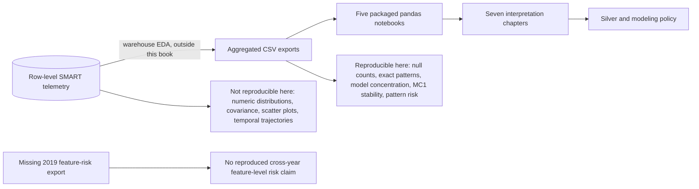

# 07. Reproducibility, limitations, and next analyses

[Analysis book](../README.md) · [Previous: Silver policy](06_silver_layer_and_modeling_policy.md) · **07 Reproducibility** · [Export manifest](../exports/README.md) · [Notebook hub](../../README.md)

## Reproducibility contract

Every notebook reads only CSV files under `../exports` relative to the notebook directory. No database connection, Snowflake credential, or hidden intermediate object is required to reproduce the conclusions in this book.

The included CSVs are already aggregated exports. Therefore the notebooks reproduce the reasoning **from those exports**, not the upstream SQL that originally generated them from raw SMART telemetry.

## Reproducibility boundary

## What these exports support

They support:

- global per-column missingness for 2018 and 2019;
- exact global null-combination frequencies;
- paired `R_x` / `N_x` missingness checks;
- model-level dominant pattern distributions;
- MC1 structural unavailability;
- MC1 dominant-pattern stability;
- MC1 null-pattern failure rates in both years;
- 2018 feature-level missingness/failure comparisons;
- failure-label null completeness and annual failure-event coverage.

## What they do not support by themselves

They do **not** contain the row-level numeric SMART values needed to reproduce scatter plots, covariance, Pearson/Spearman analysis, or the observed nonlinear `R_x` versus `N_x` relationships. Those observations may be valid from the exploratory notebook that used the raw data, but they cannot be independently recomputed from these summary CSVs.

They also do not provide a 2019 equivalent of `smart_2018_mc1_feature_missingness_risk.csv`. Cross-year conclusions about *individual feature missingness versus failure* therefore require an additional 2019 export.

The null-pattern/failure exports are observational. They cannot establish that missingness causes failure. Model, firmware, age, workload, calendar time, and other variables could confound observed rates.

## Recommended next analyses

1. Generate the missing 2019 feature-level missingness/failure export using the same logic as 2018.
2. Move from missingness structure to value-based MC1 EDA: distributions, temporal trajectories, and failure-window comparisons.
3. Reproduce `R_x`/`N_x` numerical relationship analysis from row-level SMART data and distinguish monotonic nonlinear dependence from linear correlation.
4. Construct temporal features causally, using only observations at or before each prediction date.
5. Evaluate native missing handling against explicit missingness/coverage features as separate model experiments.
6. Preserve month-based temporal validation so changes in failure prevalence are visible rather than hidden by random splitting.

## Interpretation discipline

The strongest conclusion of the current work is not “nulls predict failures.” It is that missingness is strongly structured, MC1's dominant missingness schema is extremely stable, and the dominant schema itself provides essentially no failure-risk lift over the annual MC1 baseline. This justifies preserving partial nulls while focusing predictive modeling on observed SMART values and their temporal behavior.

Return to the [analysis-book overview](../README.md) or inspect the exact
[export hashes](../exports/README.md).
