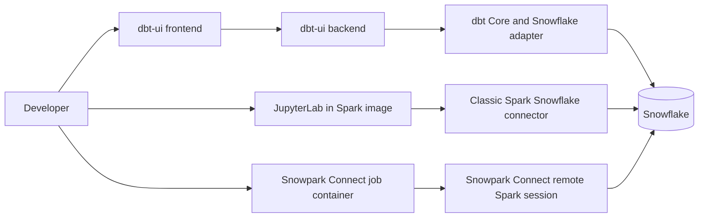

# Custom runtime images

[Project home](../../../../README.md) · **Runtime images** · [Spark notebooks](../../../main/python/spark/notebooks/README.md) · [Snowpark jobs](../../../main/python/spark/jobs/README.md)

This directory contains the reproducible image definitions used by the local
data platform. Application code remains under `src/main`; these Dockerfiles
only assemble the runtimes that execute it.

## Image inventory

| Compose service | Dockerfile or resource | Purpose |
| --- | --- | --- |
| `dbt-ui-backend` | `Dockerfile.semana05.backend` | Builds the dbt-ui API and installs dbt Core plus the DuckDB and Snowflake adapters in the backend's own virtual environment. |
| `dbt-ui` | `Dockerfile.semana05.frontend` and `dbt-ui.nginx.conf` | Builds the dbt-ui web client and serves it through Nginx, proxying `/api/` to the backend service. |
| `spark` | `Dockerfile.pset2.spark` | Extends Apache Spark 4.0.4 with the Snowflake Spark connector, JDBC driver, JupyterLab, the PySpark notebook kernel, Arrow/dataframe libraries, and plotting libraries. |
| `snowpark-connect` | `Dockerfile.pset2.snowpark` | Provides the headless Python 3.11, Java 17, Spark/PySpark 3.5.6, and Snowpark Connect runtime used by versioned execution jobs. |

All account-specific values are injected by Compose from the private
`src/res/env/.env` file. No image contains Snowflake credentials or a Jupyter
token.



The classic Spark/Jupyter image is optimized for interactive EDA. The
Snowpark Connect image is a separate headless runtime for versioned,
warehouse-executed production jobs; neither service is a substitute for the
other.

## Snowpark Connect execution image

The `snowpark-connect` service is separate from the Spark/Jupyter environment.
It is a headless, persistent job runner and therefore exposes no host port. The
container mounts the versioned code from `src/main/python/spark/jobs` and
`src/main/python/spark/lib`; its image entrypoint remains idle until a job is
executed explicitly.

Build and start it with:

```bash
docker compose --env-file src/res/env/.env build snowpark-connect
docker compose --env-file src/res/env/.env up -d snowpark-connect
docker compose --env-file src/res/env/.env ps snowpark-connect
```

Run the canonical Snowpark Connect OBT job with ordinary Python; the package
creates the remote Spark session itself:

```bash
docker compose --env-file src/res/env/.env exec snowpark-connect \
  python /opt/spark/jobs/build_mc1_obt.py
```

The Compose health check verifies only that PySpark and Snowpark Connect remain
importable. A healthy container does not by itself confirm Snowflake
authentication, warehouse access, or remote execution; those checks belong to
the submitted job.

## Spark and Jupyter image

The Spark image uses the upstream
`apache/spark:4.0.4-scala2.13-java21-python3-r-ubuntu` base. The additional
runtime components are:

- `spark-snowflake_2.13-3.2.2-spark_4.0.jar`;
- `snowflake-jdbc-4.0.2.jar`;
- JupyterLab and ipykernel;
- pandas, PyArrow, Matplotlib, and Seaborn;
- the `PySpark 4 + Snowflake` kernel specification.

The Docker build imports the principal Python packages before completing. A
missing or incompatible Jupyter dependency therefore fails the image build
instead of producing a container that repeatedly restarts at runtime.

### Why the custom notebook kernel is required

`spark-submit` automatically places Spark's Python package and Py4J bridge on
the submitted process's import path. A generic Jupyter Python kernel does not
perform that launcher setup. It could import the project helper mounted at
`/opt/spark/lib/snowflake_io.py`, but that helper then failed at
`from pyspark.sql import ...` with `ModuleNotFoundError: No module named
'pyspark'`.

The kernel at
`src/res/config/spark/kernels/pyspark-snowflake/kernel.json` starts
`/usr/bin/python3` with:

```text
SPARK_HOME=/opt/spark
PYSPARK_PYTHON=/usr/bin/python3
PYTHONPATH=/opt/spark/python:/opt/spark/python/lib/py4j-0.10.9.9-src.zip:/opt/spark/lib
```

Consequently, the notebook process can import PySpark, Py4J, and the shared
Snowflake helper. DataGrip must connect to the container's remote Jupyter URL
and select `PySpark 4 + Snowflake`; selecting a local interpreter or the generic
`Python 3 (ipykernel)` kernel bypasses this environment.

### Snowflake cloud-metadata messages

During initial connector activity, the JDBC runtime can probe cloud-provider
metadata services. In a local Docker container those services do not exist, so
logs can contain failed requests such as:

```text
PUT http://169.254.169.254/latest/api/token
GET http://169.254.169.254/metadata/instance
GET http://metadata.google.internal/computeMetadata/v1/...
```

The addresses correspond to AWS, Azure, and Google Cloud instance identity or
metadata mechanisms. Snowflake's JDBC driver supports provider-native workload
identity, which is why the runtime contains cloud credential discovery logic.
The local project authenticates with the explicitly supplied Snowflake user and
password instead.

These messages are non-fatal **only when the connector subsequently opens the
Snowflake session and the requested query returns a result**. Treat them as a
real incident if the DataFrame action fails, authentication never completes, or
no Snowflake query appears in query history. Do not disable authentication or
TLS checks merely to hide these logs.

### Wide Spark-plan warning

The 2018 null analysis generates more than one hundred aggregation expressions,
so Spark can report:

```text
WARN SparkStringUtils: Truncated the string representation of a plan since it was too large.
```

Spark truncates only the plan's **debug string** after the configured
`spark.sql.debug.maxToStringFields` limit. It does not truncate the SQL query,
source rows, result columns, or null counts. When a complete plan is genuinely
needed for diagnosis, increase the limit for that notebook session before
creating or explaining the DataFrame:

```python
spark.conf.set("spark.sql.debug.maxToStringFields", 200)
```

Leaving the default in place is preferable for routine runs because it keeps
logs manageable.

## Rebuild and validate

Rebuild whenever the Dockerfile, Python requirements, connector versions, or
kernel specification changes:

```bash
docker compose --env-file src/res/env/.env build spark
docker compose --env-file src/res/env/.env up -d --force-recreate spark
docker compose --env-file src/res/env/.env ps spark
```

If startup reports that the Jupyter host port is already allocated, identify
the owner or choose another `JUPYTER_PORT` before recreating the service. Do not
stop an unrelated container merely to reclaim the port.

Verify the runtime from a notebook using the custom kernel:

```python
import os
import sys

import pyspark
import snowflake_io

assert sys.executable == "/usr/bin/python3"
assert pyspark.__version__ == "4.0.4"
assert os.environ["SPARK_HOME"] == "/opt/spark"
assert snowflake_io.__file__ == "/opt/spark/lib/snowflake_io.py"
```

Then verify the remote connector with the small controlled query:

```bash
docker compose --env-file src/res/env/.env exec spark \
  /opt/spark/bin/spark-submit \
  /opt/spark/jobs/check_snowflake_connection.py
```

## References

- [Snowflake JDBC configuration and workload identity](https://docs.snowflake.com/en/developer-guide/jdbc/jdbc-configure)
- [Snowflake JDBC connection parameters](https://docs.snowflake.com/en/developer-guide/jdbc/jdbc-parameters)
- [Apache Spark SQL configuration](https://spark.apache.org/docs/latest/configuration)

Return to the [project README](../../../../README.md) for the service topology,
data lineage, and documentation map.
