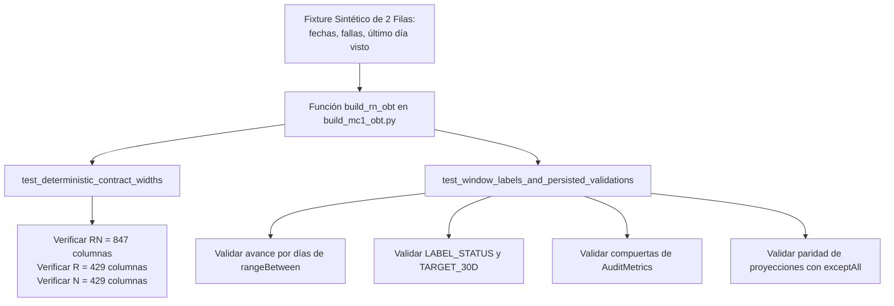

# Pruebas unitarias y de contrato de Spark

[Inicio del proyecto](../../../../../README.md) · [Plataforma Spark](../../main/python/spark/README.md) · [Jobs OBT MC1](../../main/python/spark/jobs/README.md) · **Pruebas de contrato Spark**

Este directorio contiene la suite de pruebas unitarias y de validación de contratos para el generador de la One Big Table (OBT) en PySpark.

---

## Propósito y diseño técnico

El generador canónico de la OBT ([`build_mc1_obt.py`](../../main/python/spark/jobs/build_mc1_obt.py)) está diseñado para ejecutarse sobre Snowflake mediante Snowpark Connect. Sin embargo, probar la lógica directamente contra un almacén en la nube durante el desarrollo es lento, consume créditos de cómputo y requiere conectividad de red y credenciales activas.

[`test_build_mc1_obt_contract.py`](test_build_mc1_obt_contract.py) aísla y verifica la lógica central de transformación de PySpark utilizando una sesión de Spark local y monohilo (`local[1]`).



---

## Desglose de la suite de pruebas

### 1. Construcción del fixture sintético (`_build_fixture`)

Construye un DataFrame de PySpark mínimo y determinista de dos observaciones:
- **Fechas de observación:** `2018-01-01` y `2018-01-02` para el disco sintético `ssd-1` (modelo `MC1`).
- **Evento de falla:** Falla programada para el `2018-01-20` (dentro de la ventana de anticipación predictiva de 1 a 30 días).
- **Último día visto:** `2018-02-05` (futuro suficiente para descartar que el disco haya sido censurado).
- **Atributos SMART:** El conjunto completo de 44 columnas numéricas de MC1 pobladas con valores sintéticos conocidos.

### 2. Aserción de anchos contractuales de esquema (`test_deterministic_contract_widths`)

Garantiza que la lista de columnas coincida exactamente con la especificación técnica de la OBT:
- `OBT_MC1_RN`: Exactamente **847 columnas** (6 de identidad + 836 features temporales + 5 de etiquetas).
- `OBT_MC1_R`: Exactamente **429 columnas** (6 de identidad + 418 features en representación raw + 5 de etiquetas).
- `OBT_MC1_N`: Exactamente **429 columnas** (6 de identidad + 418 features en representación normalizada + 5 de etiquetas).
- Comprueba que no existan nombres duplicados, que comiencen con `COMMON_COLUMNS` y terminen con `TARGET_COLUMNS`.

### 3. Semántica de ventanas, etiquetas y paridad (`test_window_labels_and_persisted_validations`)

- **Ventanas móviles de calendario:** Comprueba que `R_1_COUNT_7D` refleje el avance calendario (`[1, 2]`) y que la ventana previa `R_1_PREV_COUNT_7D` sea `[0, 0]` por no existir historial antes del 1 de enero.
- **Clasificación de etiquetas:** Confirma que ambas observaciones se marquen como `LABEL_STATUS = 'POSITIVE'` con `TARGET_30D = 1`, dado que la falla ocurre a 18 y 19 días de distancia.
- **Compuertas de validación de stage:** Ejecuta `validate_rn_stage` sobre el DataFrame sintético y verifica que `AuditMetrics` registre cero inconsistencias numéricas o conteos fuera de rango.
- **Paridad relacional bidireccional:** Comprueba que las proyecciones `OBT_MC1_R` y `OBT_MC1_N` contengan exactamente las mismas filas que `OBT_MC1_RN` evaluando `exceptAll` en ambos sentidos mediante `validate_variant_parity`.

---

## Cómo ejecutar las pruebas

### Opción A: Mediante Docker Compose (Recomendada)

Se ejecuta dentro del contenedor `snowpark-connect`, el cual cuenta con Python 3.11, Apache Spark 3.5.6 y PySpark configurados:

```bash
docker compose --env-file src/res/env/.env run --rm --no-deps \
  -v .:/workspace:ro \
  snowpark-connect \
  python /workspace/src/test/python/spark/test_build_mc1_obt_contract.py
```

Salida esperada:
```text
..
----------------------------------------------------------------------
Ran 2 tests in 3.120s

OK
```

### Opción B: En la máquina anfitriona (Host)

Si el entorno de Python de su máquina anfitriona tiene PySpark 3.5.x instalado:

```bash
python3 src/test/python/spark/test_build_mc1_obt_contract.py
```
